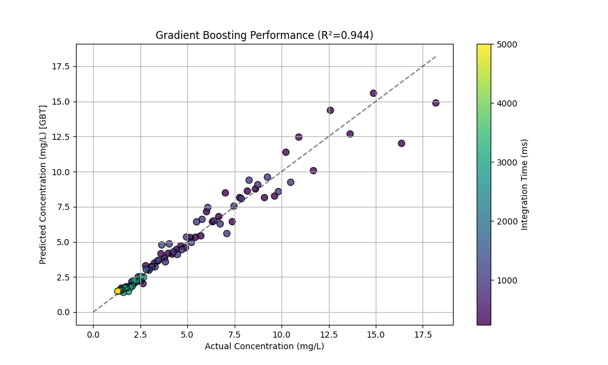
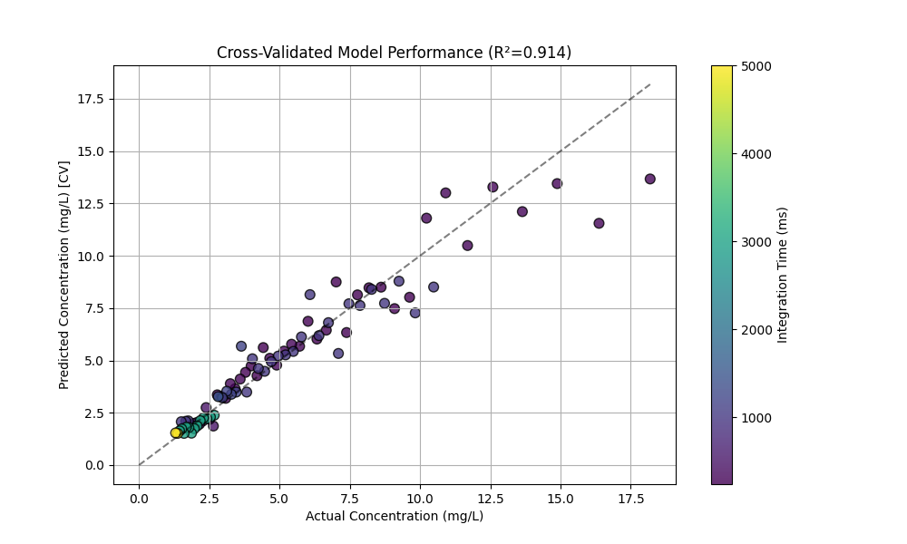

# CCD Monitor & Analysis Pipeline

A Python-based GUI application for controlling the TCD1304 CCD spectrometer (via STM32) and a complete Machine Learning pipeline for spectral analysis.

## 1. Installation

Ensure you have Python 3.10+ installed.

```bash
# Install dependencies
pip install dearpygui pyserial numpy scipy pandas scikit-learn matplotlib
```

## 2. Running the Monitor (`main.py`)

Launch the GUI to view spectral data, record samples, and manage projects.

```bash
python main.py
```

### Features:
-   **Live View**: Real-time spectral plot (inverted logic: dark=high, light=low).
-   **Controls**: Adjustable integration time (Short/Mid/Long ranges), averaging, and dummy pixel removal.
-   **Recording**: Save spectra to `.npz` files in project folders.
-   **Projects**: Organize recordings into named projects (select via dropdown).
-   **Analysis**: Real-time peak detection and flicker analysis.

## 3. Data Processing Pipeline

We perform Machine Learning on the recorded spectra to predict concentrations.

### Step A: Preprocessing (`ccd_preprocess.py`)
Converts raw recordings into a clean, feature-rich CSV dataset.

```bash
python ccd_preprocess.py
```

-   **Input**: `projects/` folder (recordings + backgrounds).
-   **Core Improvements**:
    -   **Evaporation Correction**: Calculates `elapsed_minutes` from filename timestamps to correct for solution concentration drift.
    -   **Data Cleaning**: Automatically excludes known incorrect samples (e.g., first 6 records of `blue-211`).
    -   **Background Subtraction**: Dynamic matching based on integration time.
-   **Signal Processing**:
    -   Inverts signal (`65535 - raw`).
    -   Smoothes noise (Moving Average + Savitzky-Golay).
    -   Extracts 40+ features (Peaks, Area, Centroid, Band Energies).
-   **Output**: `ccd_features.csv` and `spectra_data.npz` (for PLS).

### Step B: ML Training (`gradient_boost.py`)
Trains **Gradient Boosting** models to predict concentration (Superior to Random Forest).

```bash
python gradient_boost.py
```

-   **Performance**: Achieves **R² ~ 0.94** (vs ~0.86 for Random Forest).
-   **Auto-Ranging**: Trains 3 models (High/Mid/Low) just like RF.
-   **STM32 Compatible**: Yes! Compiles to C decision trees via `emlearn`, identical to RF.
-   **Output**: Generates `stm32_gb_model.h` for firmware integration.



*(Legacy `rand_forest.py` is also available for comparison).*


### Step C: Chemometrics Feasibility (`chemometrics_pls.py`)
Experimental script to test **Partial Least Squares (PLS)**, a standard chemometric technique.

```bash
python chemometrics_pls.py
```
-   **Result**: While feasible on STM32 (<1ms compute), PLS (R² < 0.6) significantly underperforms Random Forest (R² > 0.8) on this dataset due to non-linear saturation effects.
-   **Recommendation**: Stick with Random Forest for the STM32 implementation.

## 4. STM32 Implementation Guide

The pipeline is designed to be portable to the STM32H743 microcontroller:

1.  **Acquisition**:
    -   Run Auto-Range Loop: Start at 300ms. checking saturation. Increase to 1000ms or 3000ms if needed.
2.  **DSP**:
    -   Invert: `65535 - adc_val`
    -   Smooth: Moving Average (window=5) + Savgol Implementation.
    -   Extract Features: Simple math operations (max, sum, centroid).
3.  **Inference (Auto-Range Logic)**:
    -   The firmware measures the integration time.
    -   **If Integration Time < 500ms** (e.g., 240, 300ms) → Use **HIGH_CONC Model**.
    -   **If Integration Time 500–1500ms** (e.g., 500, 1000, 1200, 1500ms) → Use **MID_CONC Model**.
    -   **If Integration Time > 1500ms** (e.g., 3000, 5000ms) → Use **LOW_CONC Model**.
    -   Apply the corresponding Random Forest (using `emlearn` or similar tree-walker) to predict concentration.

### ❓ FAQ: Why use Ranges instead of Exact Times?
**Misconception**: "I need a separate ML model for 240ms, 250ms, 300ms, etc."
**Answer**: **No.** We train generalized models for broad ranges.
*   **Advantage 1 (Robustness)**: If your STM32 measures at 260ms (due to timing jitter), the "High Conc" model (trained on < 500ms data) still works perfectly because it learned the *relationship* between signal and time, not just fixed values.
*   **Advantage 2 (Memory)**: You only need to store **3 models** on the STM32 flash, instead of dozens of specific ones.
