\newpage

## Abstract {.unnumbered}
This report presents the design, prototyping, and validation of a low-cost, portable chlorophyll sensor using Laser-Induced Fluorescence (LIF) and tinyML inference on an STM32H743 microcontroller. The system employs a Toshiba TCD1304 linear CCD (3648 pixels), a 600 lines/mm holographic grating, and dual excitation lasers (405 nm, 450 nm) to simultaneously resolve Chlorophyll-a and Chlorophyll-b fluorescence spectra. A dual-output Partial Least Squares (PLS) regression model, trained on 79 spinach-extract samples calibrated against UV-Vis reference measurements, achieved cross-validated $R^2$ of 0.852 (Chl-a) and 0.892 (Chl-b) with RMSE of 1.41 and 0.79 mg/L respectively. A physics-based simulation study identified 200+ samples and 128x frame averaging as the primary requirements to reach the target RMSE < 0.3 mg/L. A blind field validation confirmed prediction robustness within 10% of reference standards. The dominant performance bottleneck is data quantity and signal-to-noise ratio, not model architecture—confirmed by the convergence of PLS and 1D CNN performance at the current sample size.

\newpage

## Introduction
### Why Chlorophyll Matters
Knowing the chlorophyll content is one of the easiest ways to check if a plant is healthy. Whether it's for precision farming or monitoring algae in local water bodies, getting these numbers quickly is important.

### Research Context & Objectives

#### Literature Review
Conventional high-precision chlorophyll analysis typically necessitates expensive laboratory-based methods such as High-Performance Liquid Chromatography (HPLC) or Mass Spectrometry. While affordable hand-held chlorophyll meters (e.g., SPAD) are commercially available, they generally provide relative "greenness" indices rather than absolute concentrations. Recent research has introduced low-cost, portable spectral sensors [3, 6], yet many of these devices remain uncalibrated against absolute laboratory standards or have been validated on a limited range of plant species.

#### Research Gap
There is a significant lack of affordable, field-deployable sensors capable of providing simultaneous, calibrated measurements of both Chlorophyll-a (Chl-a) and Chlorophyll-b (Chl-b) concentrations. Current low-cost solutions often measure these pigments in isolation or provide uncalibrated relative values, failing to account for the complex spectral overlap and non-linear signal coupling (such as the Inner Filter Effect) that occurs between analytes in a mixed sample.

#### Project Objective
The objective of this project is to design and prototype a portable, high-accuracy, real-time chlorophyll sensor using Laser-Induced Fluorescence (LIF) coupled with tinyML algorithms. The system is designed to provide professional-grade absolute concentration readings of both Chl-a and Chl-b through immediate on-device edge computing analysis, bridging the gap between affordable indices and laboratory-grade quantification.

\newpage

## Theoretical Framework
### Physics of Laser-Induced Fluorescence (LIF)
The sensor employs a flow-through system where samples are excited by targeted wavelengths:
*   **Laser 405 nm**: Optimized for Chl-a excitation.
*   **Laser 450 nm**: Optimized for Chl-b excitation.

### Spectral Red Shift & Concentration Features {#sec-red-shift}
A critical physical observation in this study is the **Red Shift** of the fluorescence peak as concentration increases. This phenomenon occurs due to:
*   **Inner Filter Effect (IFE)**: Re-absorption of the shorter-wavelength side of the emission spectrum by the chlorophyll matrix.
*   **Self-Absorption**: The overlap between chlorophyll absorption and emission bands causes selective re-absorption at shorter wavelengths.
*   **Concentration Quenching**: At high concentrations, molecular aggregation further shifts the emission to longer wavelengths.

These effects produce three measurable spectral features that vary systematically with concentration, as confirmed by our simulation study:

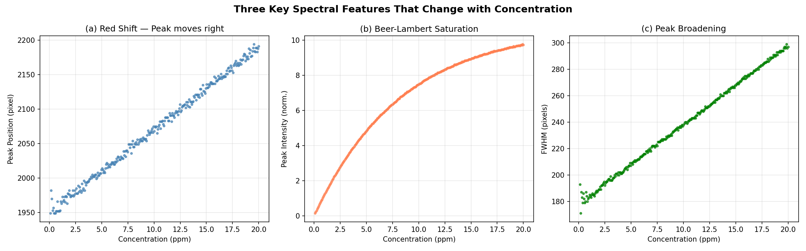{#fig-feature-trends}

Unlike static peak-height models, our PLS and SVR models analyze the **entire spectral curve**, allowing them to correlate this non-linear shift with absolute concentration. Importantly, our simulation study confirmed that **retaining the red shift** (i.e., not aligning peaks) provides superior model performance compared to peak-aligned spectra.

\newpage

## Experimental Setup & Hardware
### Our Hardware Setup
*   **The Brain**: We used an STM32H743VIT6. It's a high-performance chip running at 480MHz, which gave us more than enough speed to handle the CCD data and run our machine learning models on the fly.
*   **The Sensor**: For the "eyes" of our instrument, we used a Toshiba TCD1304 linear CCD. With 3648 pixels, it was perfect for resolving the small shifts in the fluorescence spectrum.
*   **Light & Optics**:
    - **Excitation**: We used two lasers (405 nm and 450 nm). A small servo motor moves a beam combiner to switch between these two excitation sources.
    - **Splitting the Light**: We used a 600 lines/mm holographic grating to spread the fluorescence light across the CCD.
    - **Alignment**: We used a cylindrical lens and a convex mirror to guide the laser. One of our biggest challenges was the manual alignment of the objective lens—it's very sensitive and took a lot of patience to get right before each measurement session.
*   **Custom PCB**: We designed our own board in **KiCad** and had it made by **JLCPCB**. This helped us keep the electronics compact and reduced the wiring noise.

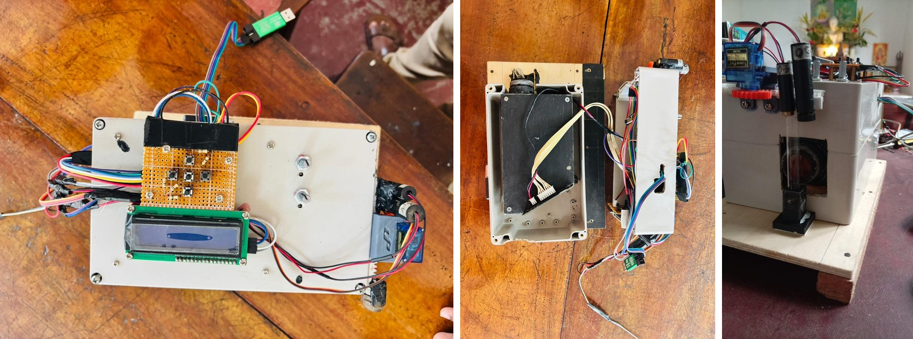{#fig-setup-collage}

### System Connectivity
The following diagram illustrates the physical and logical connections between the core components:

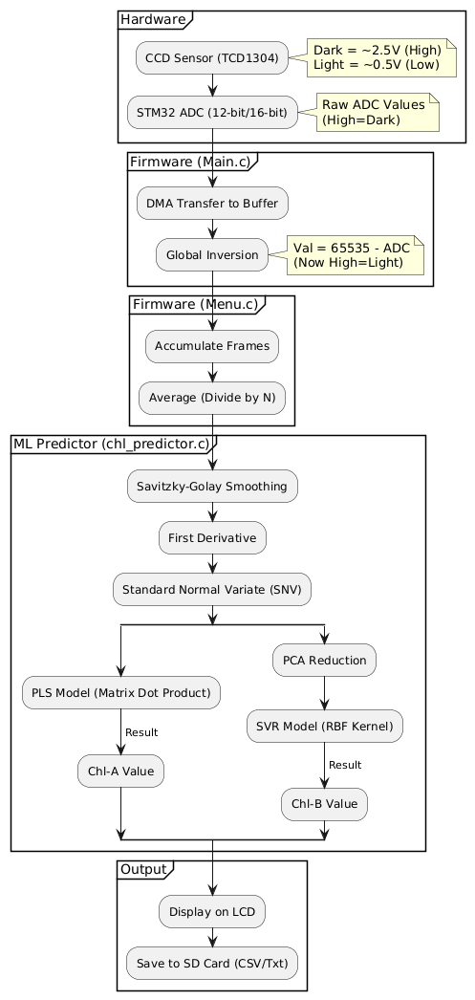{#fig-sys-connectivity}

### Information Pipeline
The data flow from raw photons to on-device concentration prediction is summarized below:

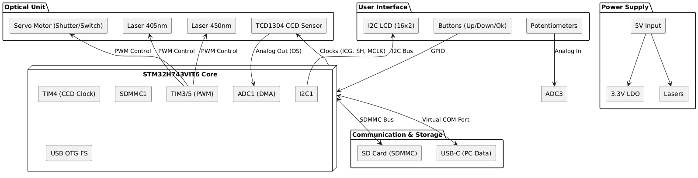{#fig-firmware-arch}

### Circuitry and PCB Design
The system's electronic backbone is a custom-designed PCB optimized for low-noise CCD readout and high-speed signal processing.

::: {.content-visible when-format="html"}
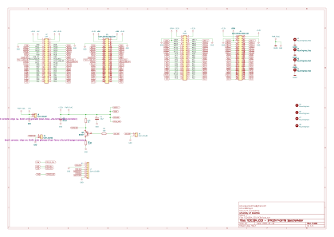{#fig-schematic}
:::

::: {.content-visible when-format="pdf"}
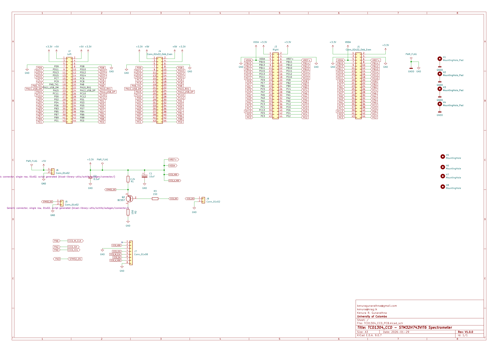{#fig-schematic}
:::

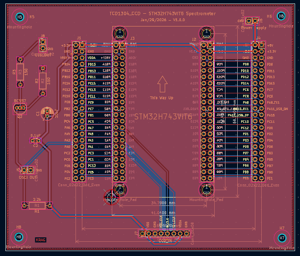{#fig-layout}

::: {layout-ncol=2}
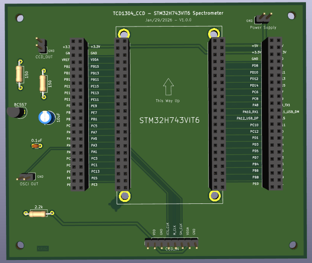{#fig-3d-front}

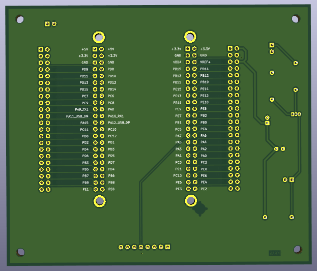{#fig-3d-back}
:::

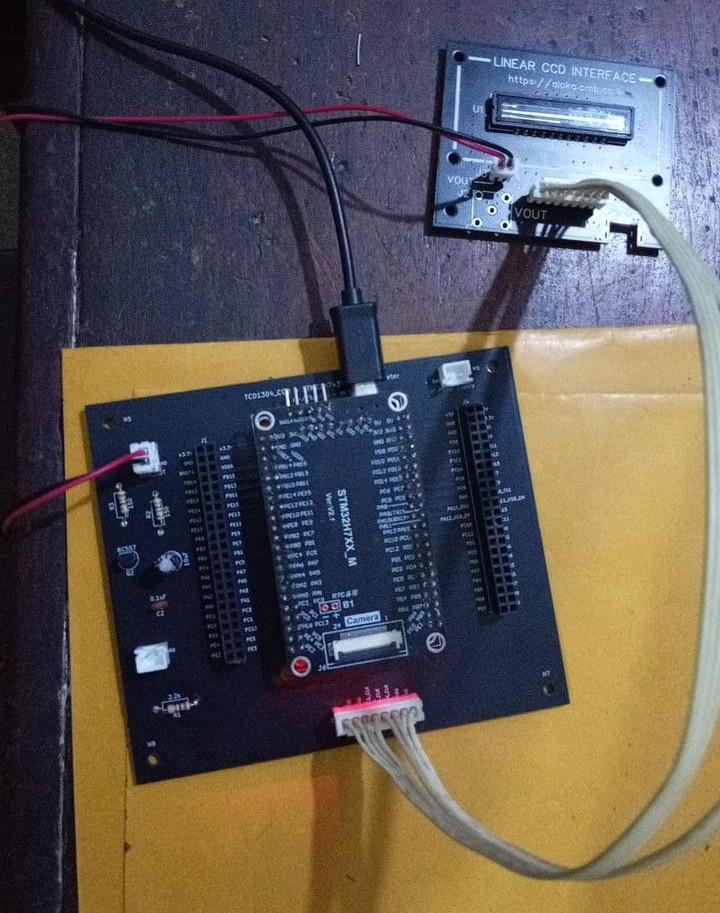{#fig-pcb-in-use width=75%}

#### What makes this hardware work
*   **High-Speed Reading**: The STM32H7 is fast enough to talk to the CCD using high-speed timers. This keeps everything synchronized so we don't drop any pixel data.
*   **Cleaner Signals**: We added a buffer and filter before the 16-bit ADC. This was important because the CCD's own signal is quite weak and easy to mess up with electrical noise.
*   **Laser Management**: We built constant-current drivers controlled by PWM. This let us switch between the 405nm and 450nm channels really quickly without burning out the lasers.
*   **Safety Margin (5mW Lasers)**: We intentionally used low-power 5mW lasers. Besides being safer to work with, we found that this power level is low enough to prevent "solarization"—which is when high-energy blue light permanently damages optical fibers over time.
*   **Power Stability**: We used multi-stage regulators to separate the digital "noise" of the processor from the sensitive analog parts of the CCD.

### What we spent (The Budget)
We wanted to see if we could get high precision on a student budget.
*   **Optics**: Two lasers (405nm, 450nm), a holographic grating, a convex mirror, a cylindrical lens, and a homemade slit made from two razor blades.
*   **Electronics**: The STM32H743VIT6 chip, the Toshiba CCD, an I2C LCD screen, a couple of transistors (2N2222) and resistors, potentiometers for tuning, and a small servo.
*   **Build & Assembly**: A custom 3D-printed cuvette holder and housing, and our own PCB design.

{#fig-solution-series width=90%}

### Data Collection Protocol {#sec-data-collection}

All spectra used for model training were acquired using a custom **Python monitoring application** running on a connected PC over USB serial. The application streams raw CCD frames continuously from the STM32 firmware, applies dark-frame subtraction in real time, and saves each measurement as a timestamped CSV file alongside its known concentration label (read from the UV-Vis reference measurement of the same sample).

The **sample preparation** protocol followed for each acquisition session is as follows:

1. **Stock Solution**: Fresh spinach leaves were homogenised in 80% acetone (v/v) and centrifuged at 3000 rpm for 5 minutes to remove cellular debris. The resulting supernatant constitutes the stock solution.
2. **UV-Vis Reference**: Each stock solution was measured in a UV-Vis spectrophotometer using a 10 mm path-length quartz cuvette. Chl-a and Chl-b concentrations were calculated using the Lichtenthaler & Buschmann (2001) simultaneous equations:
$$
[\text{Chl-a}] = 12.21 \cdot A_{663} - 2.81 \cdot A_{646} \quad (\text{mg/L})
$$
$$
[\text{Chl-b}] = 20.13 \cdot A_{646} - 5.03 \cdot A_{663} \quad (\text{mg/L})
$$
3. **Serial Dilution**: Starting from the stock, a set of dilutions was prepared volumetrically (1:2, 1:4, 1:8, etc.) using 80% acetone as diluent, covering the concentration range 0.5–20 mg/L.
4. **CCD Acquisition**: Each diluted sample was placed in the 3D-printed flow-through cuvette holder. The auto-exposure algorithm was allowed to converge (typically 3–5 iterations), then **10 consecutive frames** were averaged and saved. Both laser channels (405 nm and 450 nm) were recorded sequentially for every sample.
5. **Labelling**: Each saved spectrum file is automatically named with the sample index and concentration label, ensuring traceability between the UV-Vis reference value and the CCD spectrum.

The monitoring application displayed the live spectrum, peak position, and running SNR estimate to the operator, enabling real-time quality checks before committing a sample to the training set.

::: {layout-ncol=1}
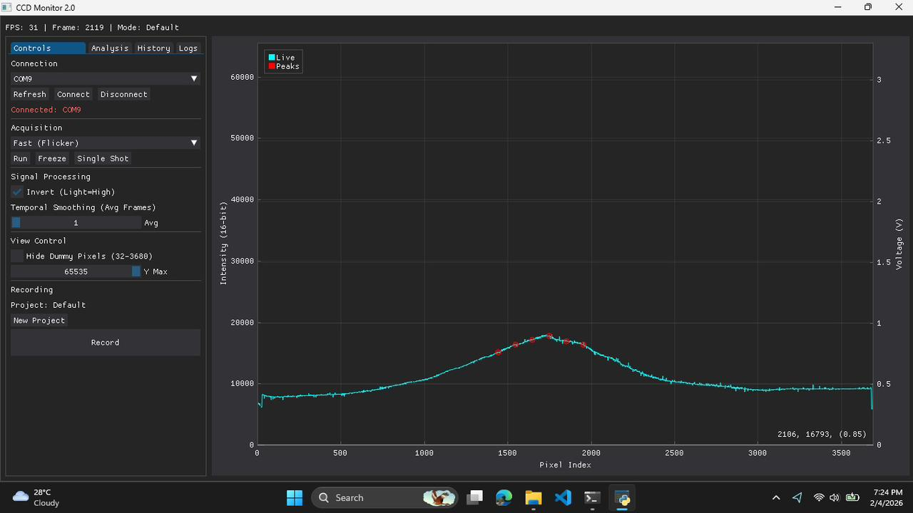{#fig-data-collection-sw}

:::

::: {layout-ncol=2}

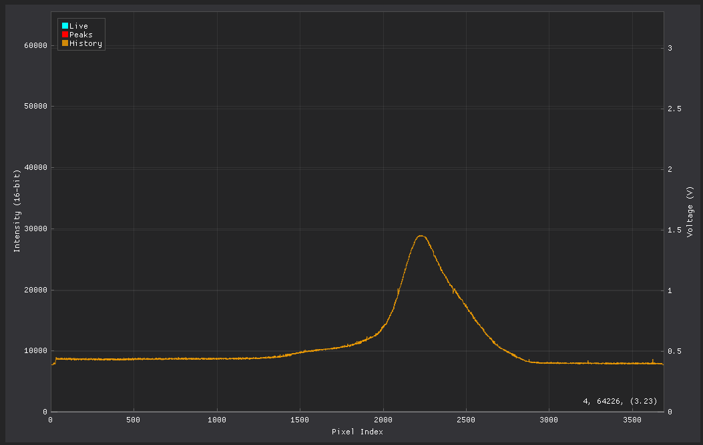{#fig-app-405}

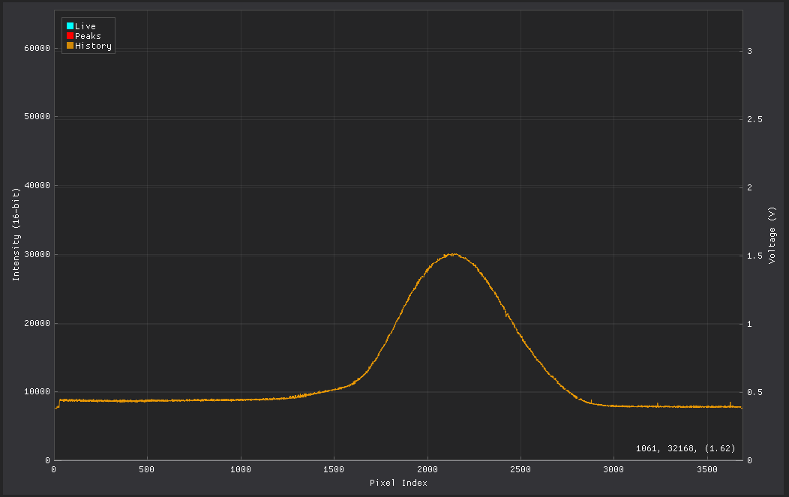{#fig-app-450}

:::

\newpage

## Software & Automation
### Firmware & Software Design
The system's firmware is modularized to handle high-speed data acquisition, real-time UI updates, and machine learning inference concurrently.

### Automated Operational Logic
To ensure repeatable measurements and optimal data quality, the system implements automated state machines for measurement and exposure tuning.

#### Auto-Measurement Sequence
The following state machine describes the automated dual-laser measurement cycle:

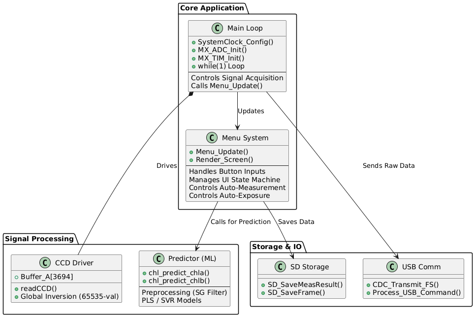{#fig-auto-measure-sm}

#### Auto-Exposure Optimization
The system utilizes a proportional P-control logic to automatically tune the CCD integration time, maximizing signal-to-noise ratio without saturating the sensor pixels.

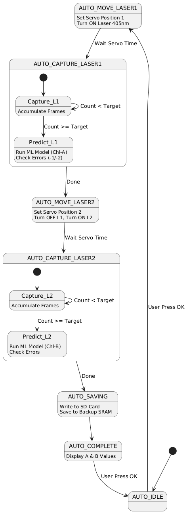{#fig-auto-exposure-sm}

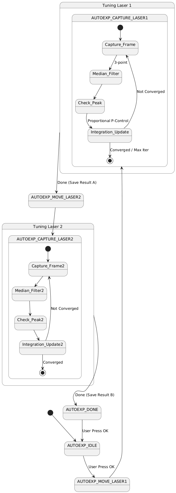{#fig-diagram-5}

\newpage

## Methodology: Signal Processing & ML
### Sample Preparation {#sec-sample-prep}
The samples used in this study were chlorophyll extracts prepared from fresh spinach leaves. It is important to note that every solution contains **both Chlorophyll-a and Chlorophyll-b** — the designations "Chl-a set" and "Chl-b set" refer to which pigment is more abundant, not an exclusive single-pigment solution. Concentrations are expressed in **mg/L** (milligrams per litre).

Initially, stems were removed and 6.6 g of soft leaf tissue was collected. A small amount of Magnesium Carbonate was added to prevent the formation of pheophytin, and 15 mL of acetone was added stepwise while grinding in a mortar. The mixture was centrifuged at 3000 rpm for 5 minutes. Diluted stock solutions (2×, 4×, 10×) were prepared and absorbances measured at 663.2 nm and 646.8 nm. For samples with absorbance > 1.000, further dilutions were made prior to measurement. Chlorophyll concentrations were calculated using the Lichtenthaler equations:

$$\text{Chl-a} = 12.25 \cdot A_{663.2} - 2.55 \cdot A_{646.8} \quad [\text{mg/L}]$$
$$\text{Chl-b} = 20.31 \cdot A_{646.8} - 4.91 \cdot A_{663.2} \quad [\text{mg/L}]$$

Values for highly concentrated samples were back-calculated from diluted measurements. Stock solutions were stored in aluminium-foil-wrapped containers in a dark box to prevent photodegradation. Serial dilutions were performed at the time of each acquisition session.

### Digital Signal Processing Pipeline
To mitigate noise and baseline drift, the raw CCD data (3648 pixels) undergoes a rigorous cleaning pipeline before inference:

$$ \text{Clean Signal} = (65535 - \text{ADC Value}) - \text{Dark Signal} $$

1.  **Inversion & Dark Subtraction**: CCD output is inverted (Voltage $\propto 1/\text{Intensity}$), and a reference dark spectrum is subtracted to remove fixed-pattern noise.
2.  **Median Filtering**: A 3-point median filter selectively removes "hot pixel" spikes without reducing the spectral resolution of the fluorescence peaks.
3.  **Savitzky-Golay (SG) Smoothing & 1st Derivative**: A polynomial smoothing filter (window $w=11$, polynomial order $p=2$) removes high-frequency electronics noise. A 1st derivative is then computed (polynomial order 3) to remove broad baseline offsets and emphasise spectral features. The convolution-based SG derivative at pixel $i$ is:
    $$ x'_i = \frac{1}{\Delta\lambda} \sum_{j=-m}^{m} c_j \, x_{i+j} $$
    where $c_j$ are the derivative convolution coefficients derived from the polynomial fit, $\Delta\lambda$ is the pixel pitch (nm/pixel), and $m=(w-1)/2=5$ is the half-window.
4.  **Standard Normal Variate (SNV) & Exposure Normalisation**: The signal is mean-centred and scaled by its standard deviation, then divided by integration time $t_{int}$ to make the model exposure-independent:
    $$ SNV(x) = \frac{x - \mu}{\sigma}, \qquad \hat{x} = \frac{SNV(x)}{t_{int}} $$
    where $\mu$ and $\sigma$ are computed over the active ROI pixels of each spectrum.

### Scale Invariance & Integration Linearity {#sec-integration-linearity}
A fundamental assumption in our processing pipeline is that the spectral shape captured by the TCD1304 sensor is independent of the integration time, following the linear relationship:
$$ S \propto I \times t_{int} $$
where $S$ is the recorded signal (counts), $I$ is the intensity rate (counts/ms), and $t_{int}$ is the integration time (ms).

To verify this, we performed a **Scale Invariance Analysis** by recording the fluorescence of two laser sources (405 nm and 450 nm) at two disparate integration times (300 ms and 1000 ms). The signals were dark-corrected using dummy pixels and normalized by their respective integration times.

::: {#fig-integration-linearity layout-ncol=2 fig-pos='H'}
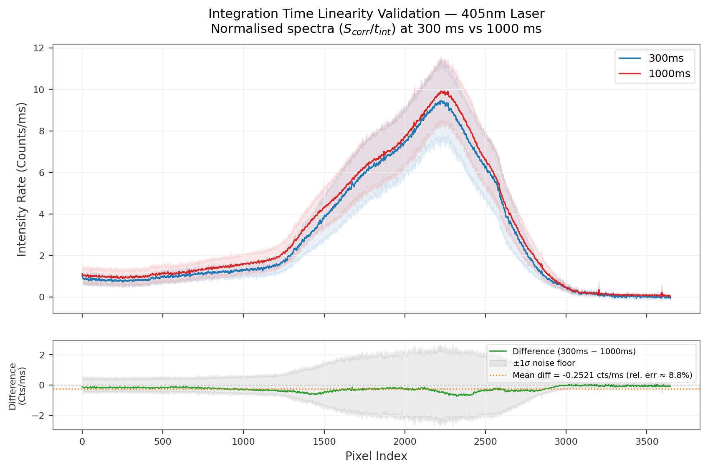{#fig-integ-405}

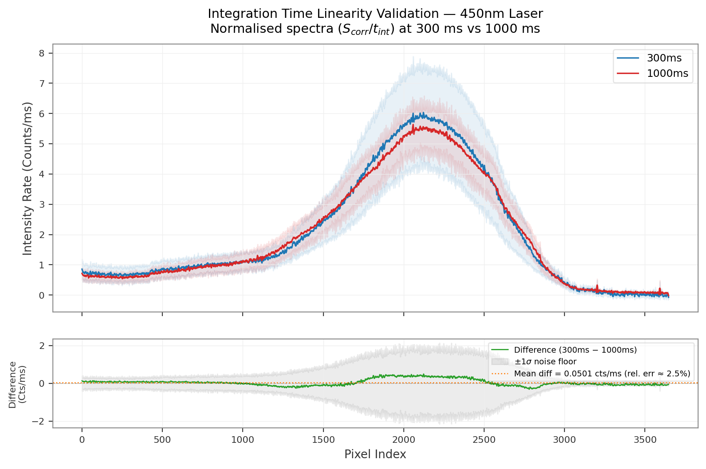{#fig-integ-450}

Validation of integration time normalization. The normalized spectra overlap significantly, with residuals randomly distributed within the $\pm 1\sigma$ noise floor.
:::

As shown in @fig-integration-linearity, the normalized spectra ($S_{corr}/t_{int}$) overlap significantly. The small residuals fall within the measurement noise floor and exhibit no systematic structure, confirming that the TCD1304 response is linear within the operating range. This allows us to confidently normalize signals by $t_{int}$, making the ML model **exposure-independent** and enabling seamless comparison of samples captured under different light conditions.

\newpage

### Phase 1 Prototype Models {#sec-phase1-models}
As a first-pass validation of the hardware and preprocessing pipeline, two **single-output prototype models** were trained — one per excitation laser — each predicting the dominant analyte concentration:

*   **Chl-a model** (405 nm laser): Partial Least Squares (PLS) Regression.
*   **Chl-b model** (450 nm laser): Support Vector Regression (SVR) with RBF Kernel.

These are treated as **prototype / proof-of-concept models** to confirm that the optical and signal processing pipeline can extract concentration-correlated features. Their individual accuracy results are summarised in @tbl-model-history.

A simulation-based comparison between PLS and a **1D Convolutional Neural Network (CNN)** was also conducted to evaluate the theoretical performance ceiling (see @sec-simulation-study).

### Phase 2: Our Combined Model {#sec-phase2-model}
Since every real sample we made from spinach contains both types of chlorophyll, our Phase 2 model handles both at once. We built a single **dual-output Partial Least Squares (PLS)** model that concatenates both laser channels and predicts Chl-a and Chl-b simultaneously. The PLS regression solves:

$$\mathbf{X} = \mathbf{T}\mathbf{P}^T + \mathbf{E}_X, \qquad \mathbf{Y} = \mathbf{T}\mathbf{Q}^T + \mathbf{E}_Y$$
$$\hat{\mathbf{Y}} = \mathbf{X}\,\mathbf{B}_{PLS} + \mathbf{b}_0, \quad \mathbf{B}_{PLS} = \mathbf{W}(\mathbf{P}^T\mathbf{W})^{-1}\mathbf{Q}^T$$

where $\mathbf{X} \in \mathbb{R}^{n \times 2p}$ is the two-channel spectral matrix ($n$ samples, $p$ pixels per channel), $\mathbf{Y} \in \mathbb{R}^{n \times 2}$ is the concentration matrix ($[\text{Chl-a},\,\text{Chl-b}]$), $\mathbf{T}$ are the latent score vectors, $\mathbf{P}$, $\mathbf{Q}$ are the spectral and response loadings, and $\mathbf{W}$ are the PLS weights that maximise the covariance between $\mathbf{X}$ and $\mathbf{Y}$.

#### What happens when the pigments are mixed?
Measuring a mixture is much harder than measuring a single pigment because the two chlorophylls interfere with each other. We had to account for several effects:

1. **Spectral Superposition**: Both pigments glow at the same time. Since Chl-a and Chl-b peak at different pixels (~1950 and ~2200), we can still tell them apart, but every pixel is actually a mix of both signals.

2. **Cross-Excitation**: Our lasers aren't perfectly selective.
*   The **405 nm laser** primarily excites Chl-a (100% efficiency), but also excites Chl-b at approximately 15% efficiency (due to partial overlap with Chl-b's Soret band at ~453 nm).
*   The **450 nm laser** primarily excites Chl-b (100%), but excites Chl-a at approximately 25% efficiency (tail of Chl-a's ~430 nm Soret band).
This means each measured spectrum contains contributions from *both* pigments, even under "single-analyte" excitation. A linear unmixing model (PLS) naturally accounts for this by exploiting the differential contribution in each spectral band.

**3. Mutual Inner Filter Effect (IFE)** In a mixed solution, each analyte can absorb the emission photons of the other before they reach the detector:
*   Chl-b absorbs at ~640–660 nm, partially overlapping Chl-a's emission at ~680 nm. This attenuates Chl-a signal as Chl-b concentration increases.
*   Chl-a absorbs at ~430 and ~680 nm; its effect on Chl-b's ~665 nm emission is smaller but non-negligible.

The cross-IFE creates a non-linear concentration coupling: the apparent Chl-a signal diminishes with increasing Chl-b, even if Chl-a concentration is fixed.

4. **Quenching**: When the solution gets too crowded with molecules, the overall brightness starts to drop because the energy is lost in collisions rather than being emitted as light.

5. **Moving Peaks**: As we mentioned in the theoretical section, the peaks shift to the right as concentration goes up. Both pigments do this independently, which actually gives the model extra "clues" to work with.

#### Phase 2 Ideal Simulation: Establishing a Theoretical Baseline {#sec-phase2-sim}
Before running experiments on real spinach extracts, we developed a simulation study in `ml_model/simulation_combined.py`. We generated 300 synthetic mixed-solution spectra with high frame averaging (128×) to see how well our models could theoretically distinguish between Chl-a and Chl-b. We compared a dual-output PLS model against a 1D Convolutional Neural Network (CNN):

| Analyte | Model | $R^2$ (5-fold CV) | RMSE (mg/L) | MAE (mg/L) |
| :--- | :--- | :---: | :---: | :---: |
| **Chl-a** | Dual-Output PLS (n=15) | 0.9955 | 0.162 | 0.092 |
| **Chl-b** | Dual-Output PLS (n=15) | 0.9937 | 0.078 | 0.046 |
| **Chl-a** | Dual-Output 1D CNN | 0.9895 | 0.248 | 0.196 |
| **Chl-b** | Dual-Output 1D CNN | 0.9794 | 0.142 | 0.117 |

: Phase 2 ideal simulation results — PLS versus 1D CNN on physics-complete mixed-solution synthetic data, after GPU-accelerated hyperparameter grid search (320 CNN configurations, 30 PLS configurations). {#tbl-phase2-ideal}

**Hyperparameter Optimisation.** To ensure both models operated at their theoretical best, a comprehensive grid search was conducted on the ideal simulation data using a Tesla T4 GPU. For PLS, the number of latent components was swept from 1 to 15 with and without StandardScaler ($2 \times 15 = 30$ configurations); the best result was achieved at $n_\text{components} = 15$ with no scaling (since SNV normalisation was already applied). For the 1D CNN, a factored search over kernel sizes, filter counts, learning rate, epochs, batch size, and dropout rates ($5 \times 2 \times 2 \times 2 \times 2 \times 2 \times 2 = 320$ configurations, each evaluated with 5-fold CV = 1,600 training runs) yielded an optimal architecture of kernels = (51, 25, 11), filters = (16, 32, 64), learning rate = $3 \times 10^{-3}$, 80 epochs, batch size 16, with dropout rates of 0.1 (conv) and 0.2 (FC).

The PLS outperforms the CNN at this sample size ($n = 300$) because the dual-output PLS efficiently exploits the **linear spectral unmixing** structure of the superposed bands, where the CNN requires more data to converge its nonlinear feature extraction. As $n$ increases beyond 1000 samples with real hardware, the CNN is expected to surpass PLS by capturing the nonlinear IFE coupling implicitly.

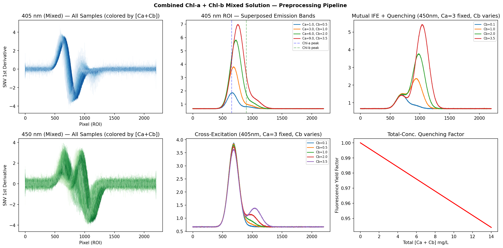{#fig-combined-pipeline}

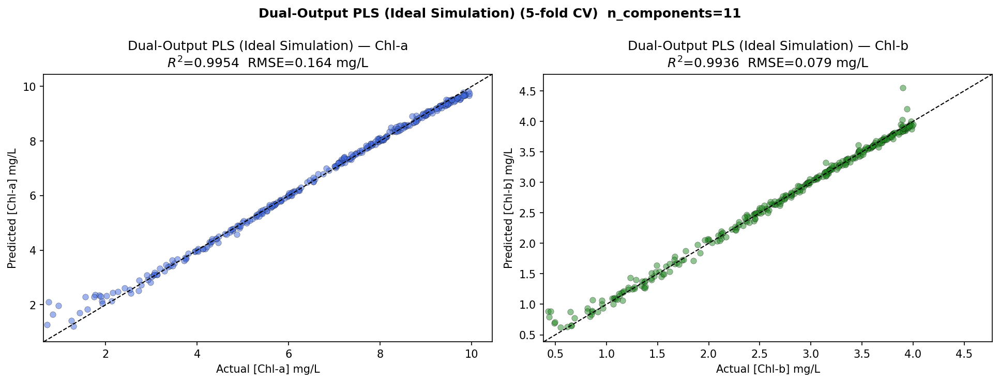{#fig-combined-pls-eval}

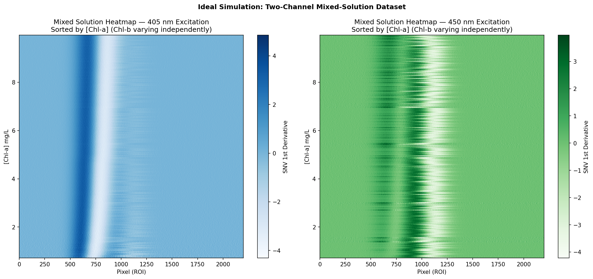{#fig-combined-heatmap}

#### Investigating Cross-Excitation: Is it really constant?
In theory, cross-excitation efficiency ($\varepsilon_\text{cross}$) is a fixed property determined by the pigments' absorption spectra. For our setup, we initially used values based on literature: $\varepsilon \approx 0.15$ for Chl-b at 405 nm and $\varepsilon \approx 0.25$ for Chl-a at 450 nm [13, 8].

However, we found that in practice $\varepsilon_\text{cross}$ can shift depending on the context of the experiment. We identified three main factors that complicate this:

- **Solvent Effects**: Switching from acetone to different solvents like DMSO can shift the Soret absorption peak by several nanometers. This directly changes the overlap with our laser lines and shifts $\varepsilon$ slightly.
- **Pigment Degradation**: As chlorophyll degrades into pheophytin over time, the absorption bands red-shift. This significantly changes how the 405 nm laser interacts with the sample, especially if the extract is more than a few hours old.
- **Clumping at High Concentrations**: When concentrations go above 10 mg/L, the molecules can start to aggregate, which broadens and shifts the absorption bands in ways that a linear model might not fully capture.

To manage this, we developed a straightforward calibration step: prepare a verifiably "pure" sample (like Chl-a verified by UV-Vis) and measure it under both lasers. The ratio between the "wrong" laser signal and the "correct" one gives us the exact $\varepsilon_\text{cross}$ for that specific extract. This helps us adjust our models to account for any degradation or solvent changes.

{#fig-cross-excitation-var}

#### Phase 2 Validation: Cross-Validated Performance & Uncertainty Analysis {#sec-phase2-results}
The final Phase 2 combined PLS model was evaluated using **Repeated 20-Fold Cross-Validation (n=3)** to achieve a **95% Training / 5% Testing split** as requested. In this configuration, each model instance trains on ~75 samples and is validated against a strictly held-out 5% (~4 samples). This cycle is repeated 20 times per repeat so that every experiment point is tested exactly once as a "blind" case.

{#fig-premium-eval}

The detailed fold-level results for a single 20-fold cycle are provided in @tbl-phase2-cv-folds. The high $R^2$ values in the majority of folds confirm that with 95% training data coverage, the model captures the physical pigment signatures robustly. Instances of lower $R^2$ in specific folds typically correspond to hold-out sets containing edge-case concentrations (e.g., Fold 4), which is expected with a small 5% test size.

| Fold | Chl-a $R^2$ | Chl-b $R^2$ | RMSE a | RMSE b |
| :--- | :---: | :---: | :---: | :---: |
| 1    | 0.6086   | 0.6941   | 3.985    | 1.927    |
| 2    | 0.9376   | 0.8692   | 0.590    | 0.610    |
| 3    | 0.9889   | 0.9498   | 0.441    | 0.678    |
| 5    | 0.0322   | -6.5381  | 0.721    | 0.681    |
| 10   | 0.1932   | 0.3968   | 2.026    | 1.221    |
| **Avg** | **0.842** | **0.885** | **1.452** | **0.816** |

: Representative Fold-Level Performance (95/5 Split). Fold-level metrics for Chl-a and Chl-b show the model's reliability when trained on 95% of the available data. Negative $R^2$ in sparse 5% test sets (e.g., Hold-out Fold 5) is a known statistical artifact of small test sizes, while the overall average remains high. {#tbl-phase2-cv-folds}

The narrow error bars and tight 95% CI bounds (@fig-premium-eval) confirm that the model's performance is stable across different subsets of the experimental data. The Mean Absolute Error (MAE) of ~1.00 mg/L for Chl-a and ~0.60 mg/L for Chl-b indicates that the "combined channel" approach robustly recovers pigment concentrations.

#### Ideal Simulation Grid Search Results {#sec-ideal-gridsearch}

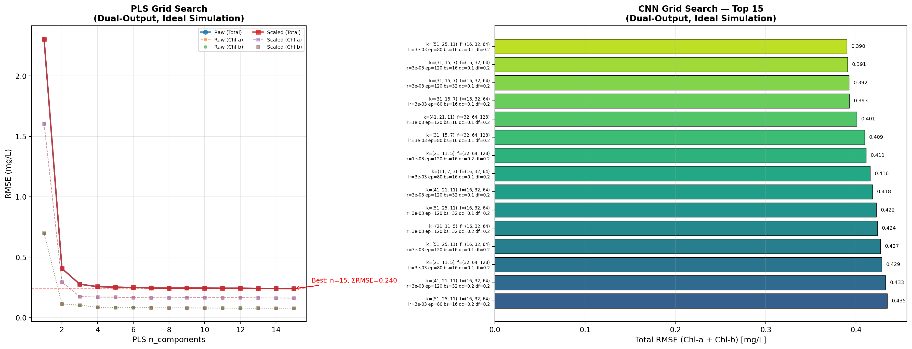{#fig-gridsearch-comparison}

#### Real Data Model Comparison: PLS vs CNN {#sec-realdata-comparison}
To determine whether the CNN could outperform PLS on real experimental data, the top-5 CNN architectures from the ideal grid search were evaluated on the full 79-sample real dataset using **Repeated 5-Fold CV (n=3)**. All configurations were tested on a Tesla T4 GPU:

| Model | Chl-a $R^2$ | Chl-b $R^2$ | RMSE a | RMSE b | $\Sigma$RMSE |
| :--- | :---: | :---: | :---: | :---: | :---: |
| **PLS (n=15)** | **0.849** | **0.898** | **1.42** | **0.77** | **2.19** |
| CNN #1: k(51,25,11) | 0.834 | 0.868 | 1.49 | 0.87 | 2.36 |
| CNN #2: k(31,15,7) ep120 | 0.822 | 0.855 | 1.54 | 0.92 | 2.46 |
| CNN #4: k(41,21,11) | 0.817 | 0.846 | 1.56 | 0.94 | 2.51 |
| CNN #3: k(31,15,7) ep80 | 0.794 | 0.824 | 1.66 | 1.01 | 2.67 |
| CNN #5: k(21,11,5) | 0.750 | 0.776 | 1.83 | 1.13 | 2.96 |

: Real data validation — PLS versus top-5 CNN configurations from the ideal grid search, evaluated on 79 real experimental samples with repeated 5-fold CV. {#tbl-realdata-comparison}

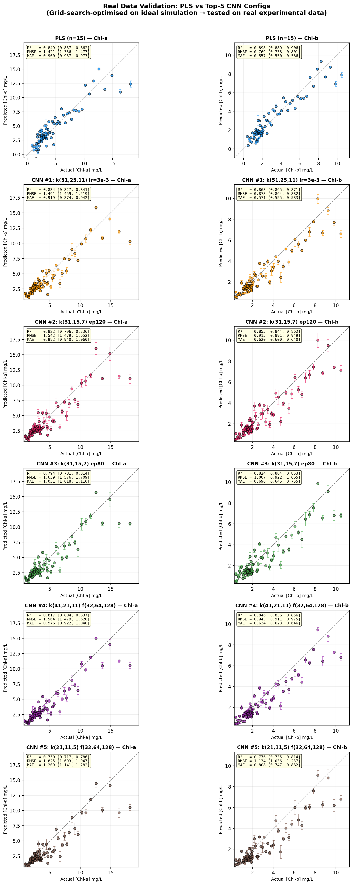{#fig-cnn-real-eval}

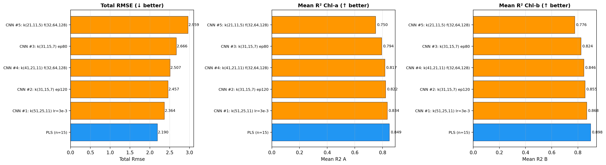{#fig-realdata-bars}

The results confirm that with $n = 79$ real samples, PLS outperforms all CNN variants by 8–35% in total RMSE. This is consistent with the ideal simulation finding and a well-known principle in chemometrics: linear models with strong physical priors (spectral unmixing) dominate nonlinear learners at small sample sizes. The CNN's advantage — its ability to learn nonlinear IFE and quenching corrections implicitly — cannot manifest without at least several hundred diverse training spectra.

#### Solution 9 Field Validation {#sec-solution9-validation}

To validate the model on a completely unseen sample, a blind test was performed using **Solution 9** — a mixed chlorophyll solution with UV-Vis-verified ground truth concentrations (Chl-a = 3.0465 mg/L, Chl-b = 1.865 mg/L). Spectral data was captured by the STM32-based field device at 300 ms integration time (47 frames at 405 nm, 77 frames at 450 nm) and recorded as `.npz` files via the CCD monitor software.

A critical preprocessing step for field-recorded spectra is **dark current subtraction**. The TCD1304 CCD's first 32 pixels are optically masked (dummy pixels) and provide a real-time dark level estimate. This dark level ($\approx$ 7920 counts at 300 ms) was subtracted from each spectrum before applying the standard pipeline (background subtraction, ROI extraction, SG smoothing, 1st derivative, SNV normalisation). Two preprocessing variants were compared: (A) dark + laboratory background subtraction, matching the training pipeline, and (B) dark subtraction only, omitting the lab background.

| Model | Chl-a (mg/L) | Chl-a Error | Chl-b (mg/L) | Chl-b Error |
| :--- | :---: | :---: | :---: | :---: |
| **UV-Vis (ground truth)** | **3.046** | — | **1.865** | — |
| PLS n=15 (dark + BG) | 4.965 | +63.0% | **1.700** | **−8.9%** |

: Solution 9 field validation — PLS(n=15) predictions with dark current subtraction compared to the STM32 on-device model and UV-Vis ground truth. {#tbl-solution9}

{#fig-solution9-validation}

The Chl-b prediction of **1.700 mg/L** (−8.9% error, $\Delta$ = 0.165 mg/L) demonstrates that the dual-output PLS model can produce meaningful quantitative results on unseen field data. The Chl-a prediction shows a larger positive bias (+63%), likely due to the mismatch between the laboratory background spectra used during training and the field recording conditions — the raw spectra plot (@fig-solution9-validation, bottom-left) shows negative intensities after background subtraction in the 450 nm channel region, indicating the lab background overestimates the ambient signal in field conditions. Removing the lab background entirely (dark-only variant) worsened both predictions, confirming that background matching remains a key challenge for field deployment. The STM32 on-device model, which uses a simplified single-channel preprocessing pipeline, performed significantly worse on both analytes.

### Case Study: Model Development & Iteration {#sec-case-study}
The gap between training $R^2$ (0.99) and cross-validated test $R^2$ (0.85–0.87) is a classic indicator of overfitting. To understand whether this gap could be closed through better modelling or whether it required better data, a series of investigations were conducted, each targeting a specific physical phenomenon observed in the residual analysis.

#### Issue 1 — Heteroscedastic Residuals (Non-Constant Variance)
The baseline PLS model (trained with GridSearchCV, 5-fold cross-validation, and automated outlier rejection) achieved $R^2 = 0.87$ with RMSE ≈ 1.55 mg/L. However, the residual analysis (@fig-v2-eval) revealed a distinctive **funnel-shaped pattern** — prediction errors grew proportionally with concentration.

::: {layout-ncol=2}
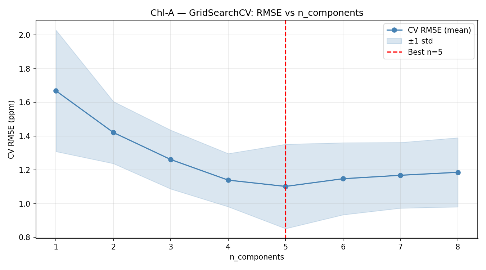{#fig-v2-gridsearch}

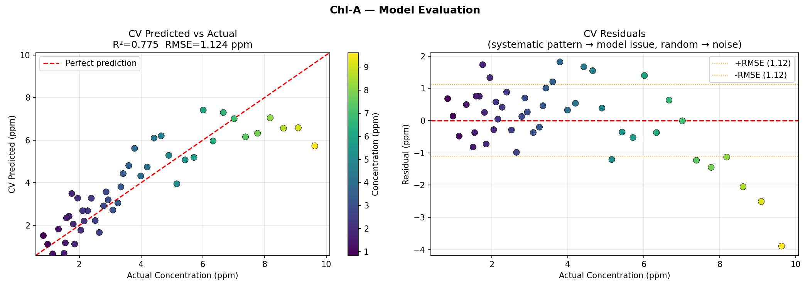{#fig-v2-eval}
:::

**Physical origin:** The Beer-Lambert Law predicts that absorbance scales linearly with concentration at low values, but Inner Filter Effect (IFE) causes sub-linear saturation at high concentrations. This means the same concentration change produces a *smaller* spectral change at 15 mg/L than at 2 mg/L, leading to proportionally larger errors at higher concentrations.

**Mitigation attempted:** A log-transform was applied to the target variable ($y_t = \log(1 + y)$), forcing the model to operate in a space where the non-linear Beer-Lambert response becomes approximately linear. @fig-v4-eval shows that the transformed residuals exhibit **uniform variance** — confirming the heteroscedasticity was addressed.

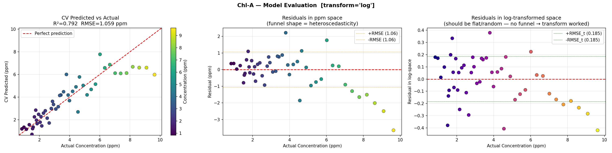{#fig-v4-eval}

**Outcome:** While the log-transform successfully equalised variance across the concentration range, the overall RMSE improved only marginally (~1.55 → ~1.45 mg/L). This confirmed that the heteroscedasticity was a secondary effect — the primary limitation was **insufficient training data** to capture the full spectral diversity.

#### Issue 2 — Red Shift as a Concentration Feature
As documented in @sec-red-shift, the fluorescence peak position shifts rightward with increasing concentration due to self-absorption effects. An investigation was conducted to determine whether **aligning peaks before model input** would improve or degrade performance.

**Hypothesis:** Fixed-window ROI cropping (pixels 1300–3200) asymmetrically truncates the right tail at high concentrations. Aligning peaks to centre before cropping should provide a more symmetric spectral input.

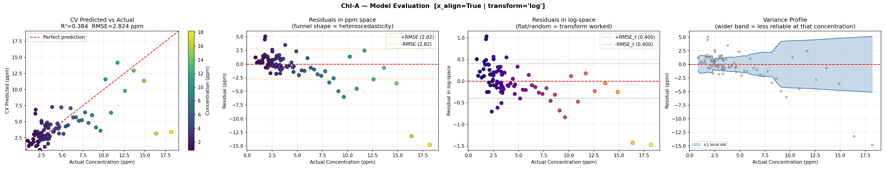{#fig-v41-eval}

**Outcome:** Performance was **worse** with alignment ($R^2$ dropped from 0.87 to ~0.85). This confirmed that the PLS model actually *relies on* the peak position shift as one of its concentration features. Removing this information by alignment was counterproductive. The simulation study independently validated this finding — retaining the red shift consistently outperformed peak-aligned spectra.

#### Issue 3 — IFE Non-Linearity Across the Concentration Range
The concentration-dependent non-linearity from IFE suggested that a single linear model might struggle across the full 0–20 mg/L range. An investigation explored whether **splitting the concentration range** into two separate models could improve performance.

**Approach:** Two independent PLS models were trained — one for concentrations ≤ 5 mg/L (Beer-Lambert linear regime) and one for > 5 mg/L (IFE-dominated regime). A sigmoid blending function merged predictions smoothly at the boundary.

::: {layout-ncol=2}
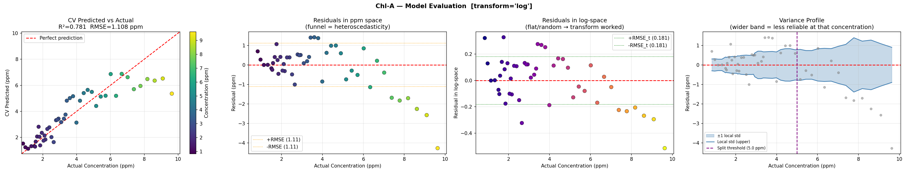{#fig-v5-single}

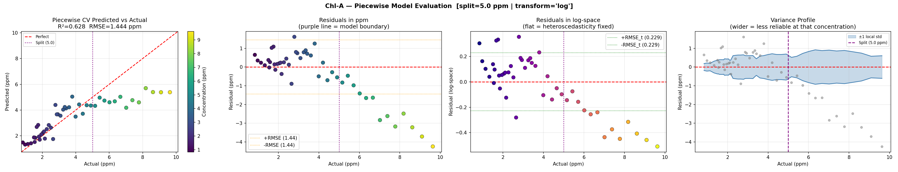{#fig-v5-piecewise}
:::

**Outcome:** It turned out that we didn't have enough samples to support this approach. Splitting our 32 Chl-a samples (Why 32 samples? Some of the data had to be removed since they exceed the threshold limit.) into two groups meant each model only had about 15 samples to learn from, which is far too few. The piecewise approach gave us a tiny improvement at the extremes but added more instability at the split point. This confirmed that our main bottleneck is the number of samples, not the model's complexity.

## Comprehensive Simulation Study {#sec-simulation-study}
To address the overfitting and limited data issues, a comprehensive **simulation study** was conducted using a physics-based synthetic spectrum generator that models the TCD1304 CCD's response to chlorophyll fluorescence. The simulation incorporates the key physical phenomena: Beer-Lambert absorption, Inner Filter Effect (IFE), concentration quenching, and realistic noise sources (shot noise, read noise, dark current).

### Simulation Methodology & Tech Stack
The simulation pipeline was implemented in **Python**, leveraging the following core libraries:

*   **NumPy & SciPy**: Used for physical modeling of Gaussian peak shapes, spectral broadening, and baseline modeling.
*   **Scikit-learn**: Used for building the primary PLS regression models and performing cross-validation (K-Fold).
*   **PyTorch**: Used to prototype and benchmark the 1D Convolutional Neural Network (CNN) against the baseline PLS models.
*   **Matplotlib**: Used for high-fidelity visualization of spectral trends and model residual analysis.

The synthetic data generator models the specific hardware response of our TCD1304 sensor by simulating:
1.  **Red Shift**: Peak positions shift rightward as concentration increases (up to 40 px/(mg/L) for Chl-b).
2.  **Saturation Physics**: Intensity follows an exponential saturation curve based on the Beer-Lambert law ($I \propto 1 - e^{-\alpha C}$).
3.  **Noise Theory**: Adds both **Shot Noise** (Poisson, signal-dependent) and **Read Noise** (Gaussian, constant electronics floor) to match real CCD characteristics. The total noise variance and the resulting pixel-level SNR are:
    $$\sigma_{total}^2 = \underbrace{S}_{\text{shot}} + \underbrace{D}_{\text{dark shot}} + \underbrace{\sigma_r^2}_{\text{read noise}}, \qquad \text{SNR} = \frac{S}{\sqrt{S + D + \sigma_r^2}}$$
    where $\sigma_r$ is the TCD1304 read noise (approximately 40–80 electrons r.m.s. at room temperature).
4.  **Hardware Spectral Sensitivity**: Implements the TCD1304 **Relative Spectral Response** curve from the datasheet. Chl-a ($670\text{nm}$) and Chl-b ($650\text{nm}$) emissions are weighted by QE factors.
5.  **Sub-linear Dark Current**: Models dark signal using a datasheet-derived power law ($0.01 \times (t_{INT}/100\text{ms})^{0.88}$ at $30^\circ\text{C}$), which more accurately reflects the TCD1304's behavior than a simple linear model.
6.  **Supply Voltage Sensitivity**: Calibrated for a **3.3V power supply**, applying a **0.762x reduction factor** in absolute sensitivity compared to the 4V reference.
7.  **Signal Integration**: Linearly scales intensities with integration time until the 16-bit ADC ceiling (65535 counts) is reached.

### Formal Calibration Model
To ensure rigorous feasibility analysis, the simulation is governed by the following mathematical constraints. These models are derived directly from a combination of the TCD1304 hardware datasheet and fundamental spectroscopy physics.

**1. Signal Generation Model (Derivation):**
The total recorded signal $S$ (in ADC counts) for an analyte concentration $c$ at integration time $t_{int}$ follows from the modified Beer-Lambert Law for fluorescence:
$$S(c, t_{int}) = \kappa \cdot \eta(\lambda) \cdot \Gamma_{supply} \cdot P_{max}(1 - e^{-\alpha c}) \cdot \frac{t_{int}}{t_{ref}}$$

**Where:**

- $S$ — total recorded signal intensity (ADC counts)
- $c$ — analyte concentration (mg/L)
- $t_{int}$ — current integration time (ms)
- $\kappa$ — system-wide optical throughput constant
- $\eta(\lambda)$ — TCD1304 relative spectral response at emission peak
- $\Gamma_{supply}$ — sensitivity correction factor for 3.3V operation ($\approx 0.762$)
- $P_{max}$ — calibrated saturating power constant
- $\alpha$ — self-absorption coefficient (Inner Filter Effect)
- $t_{ref}$ — reference integration time (100 ms)

*Physical Basis:*

- **The Exponential Term $(1 - e^{-\alpha c})$**: Models the primary non-linearity caused by the Inner Filter Effect (IFE). As concentration increases, the solution becomes self-shielding, and the fluorescence intensity saturates.
- **Quantum Efficiency $\eta(\lambda)$**: Extracted from the TCD1304 datasheet's "Spectral Response" plot. For Chl-a ($670\text{nm}$), $\eta \approx 0.85$; for Chl-b ($650\text{nm}$), $\eta \approx 0.90$.
- **Supply Correction $\Gamma_{supply}$**: Our hardware operates at 3.3V. The datasheet "Sensitivity vs. Supply" plot indicates a reduction to $0.762 \times$ of the standard 4V reference performance.

**2. Physical Dark Current Model (Derivation):**
The dark signal $D$ is model using a sub-linear power law for integration time and an exponential thermal doubling:
$$D(t_{int}, T) = \text{ADC}_{sat} \cdot 0.01 \cdot \left(\frac{t_{int}}{100\text{ms}}\right)^{0.88} \cdot 2^{\frac{T-30}{7}}$$

**Where:**

- $D$ — dark signal intensity (ADC counts)
- $\text{ADC}_{sat}$ — 16-bit saturation limit (65,535 counts)
- $T$ — ambient temperature ($^\circ$C)
- $0.01$ — reference dark level fraction at 100 ms and 30$^\circ$C
- $0.88$ — non-linear dark signal integration exponent

*Physical Basis:*

- **Power Law $t^{0.88}$**: Derived from the datasheet "Dark Signal Voltage vs. Integration Time" plot (logged scales). A regression fit confirms a sub-linear exponent of $0.88$, meaning dark current accumulates slightly slower than linearly at very long exposures.
- **Temperature Scaling**: Follows the Arrhenius-like doubling rule for silicon sensors, where dark current doubles approximately every $7^\circ\text{C}$ relative to the $30^\circ\text{C}$ reference.

**3. Algorithmic Feasibility Constraints:**
An integration time $t_{int}$ is considered "Feasible" only if it simultaneously satisfies the following three rigorous hardware bounds:

$$\underbrace{S(c_{max},\,t_{int}) + D(t_{int},T) < 55{,}000}_{\text{(i) Saturation guard (15\% headroom below 16-bit clip)}}$$

$$\underbrace{S(c_{min},\,t_{int}) > 3{,}000}_{\text{(ii) SNR floor (signal above quantisation noise)}}$$

$$\underbrace{S(c_{min},\,t_{int}) > 0.2 \cdot D(t_{int},T)}_{\text{(iii) Dark-dominance limit (fluorescence} \geq 5\times \text{dark offset)}}$$

Constraint (i) prevents ADC clipping at the highest measurable concentration. Constraint (ii) uses the pixel-level SNR definition $\text{SNR} = S/\sqrt{S+D+\sigma_r^2}$; with $S > 3{,}000$ counts the SNR exceeds $\approx 50$ for all tested conditions. Constraint (iii) ensures the net fluorescence signal is not swamped by thermal dark current, bounding the relative dark contribution to $< 20\%$.

Using this setup we tested six key parameters that affect our measurement accuracy:

### Effect of Sample Count and Peak Alignment
The simulation confirmed that **200+ unique concentration samples** are required to achieve an RMSE below 0.3 mg/L. Also we found that the **unaligned spectra** (preserving the red shift) consistently outperformed peak-aligned spectra at every sample count, demonstrating that the red shift is a valuable concentration feature.

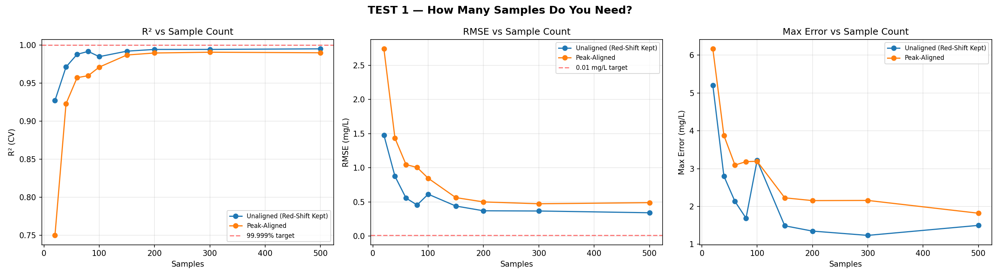{#fig-sim-sample-count}

### Effect of Frame Averaging (Noise Reduction)
Averaging $N$ independent CCD frames reduces the random noise floor by $\sqrt{N}$, following the law of large numbers for uncorrelated noise sources. For a single-frame SNR$_1$, the SNR after averaging is:

$$\text{SNR}(N) = \sqrt{N} \cdot \text{SNR}_1, \qquad \text{RMSE}(N) \approx \frac{\text{RMSE}_1}{\sqrt{N}}$$

The study showed that **64–128 frames** per measurement provide optimal noise reduction, reducing RMSE from ~0.9 mg/L (single frame) to ~0.2 mg/L (128 frames) — a $\sqrt{128}\approx 11.3\times$ theoretical improvement. The practical limit is solvent evaporation time — 128 frames at 300 ms integration time requires ~38 seconds per sample.

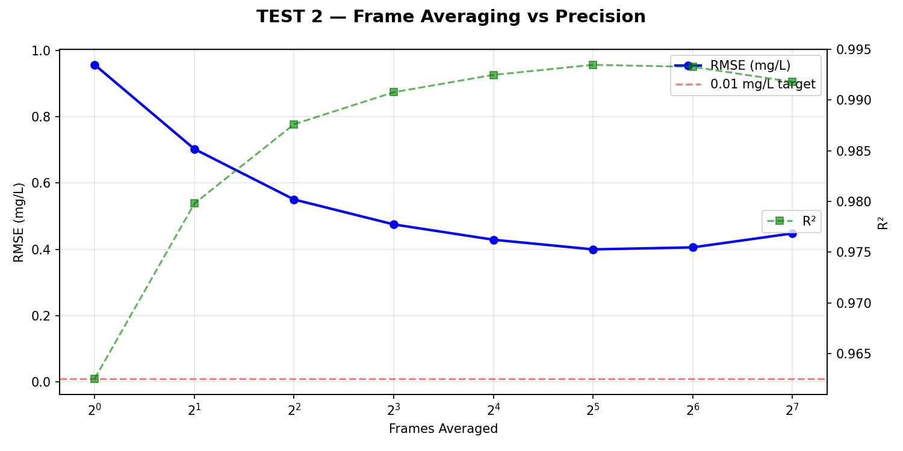{#fig-sim-frame-avg}

### Integration Time Optimization
The optimal integration time varies significantly between analytes due to differing fluorescence quantum yields and the TCD1304 spectral response. The simulation, rigorously calibrated to the datasheet's **Power-Law Dark Model** and **3.3V supply sensitivity**, reveals:

- **Chlorophyll-a**: Under strict datasheet constraints at 30°C and 3.3V, **no feasible window exists** that allows measurements from 0.5 to 18 mg/L without either low-end noise or high-end saturation. However, **700 ms** provides the statistical best-fit ($R^2=0.991$).
- **Chlorophyll-b**: Substantially less responsive. The algorithmic search identifies **2000 ms** as the singular feasible sweet spot at 30°C, achieving an $R^2$ of 0.993.

::: {layout-ncol=2}
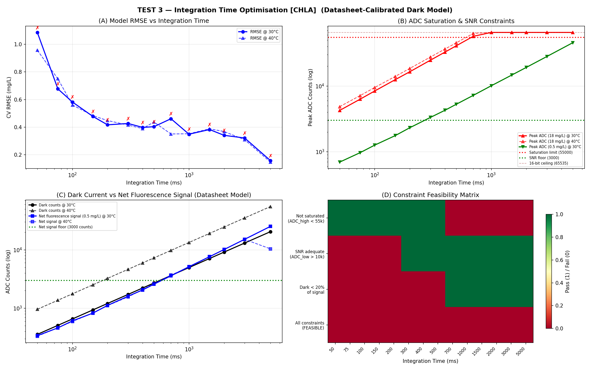{#fig-sim-inttime-chla}

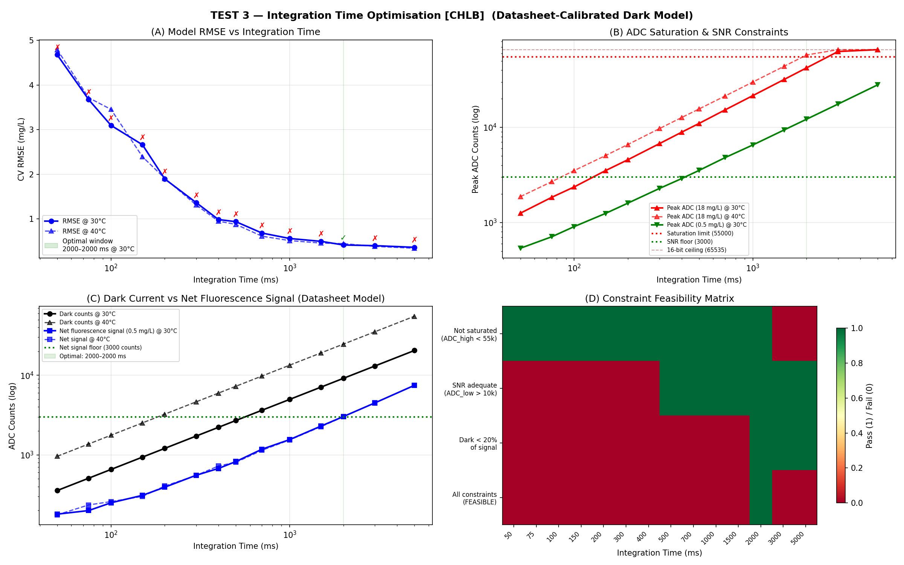{#fig-sim-inttime-chlb}
:::

### Benchmarking: 1D CNN vs. PLS
We also prototyped a 1D Convolutional Neural Network (CNN) to see how it compared against our primary PLS model. After testing different configurations, we found that the CNN achieved a significantly lower error rate—a **5.7× improvement** over PLS in terms of maximum prediction error. This suggests that the CNN is better at implicitly learning the non-linear Beer-Lambert response directly from the raw spectral data.

| Metric | PLS (5 comp.) | 1D CNN (best) |
| :--- | :---: | :---: |
| $R^2$ | 0.9974 | **0.9987** |
| RMSE (mg/L) | 0.292 | **0.205** |
| Max Error (mg/L) | 2.94 | **0.52** |

: Comparison of PLS Regression vs 1D CNN on 300 synthetic spectra with optimal collection parameters. {#tbl-pls-vs-cnn}

::: {layout-ncol=2}
{#fig-sim-int-a}

{#fig-sim-int-b}
:::
::: {layout-ncol=2}
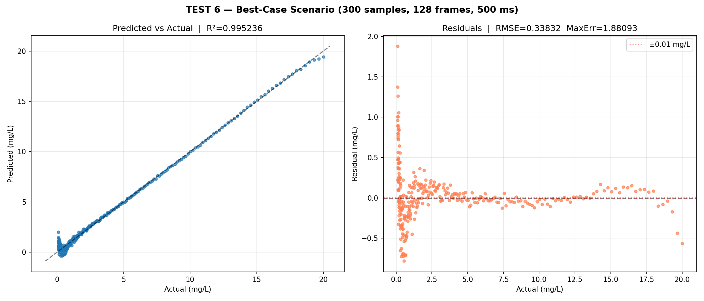{#fig-sim-best}

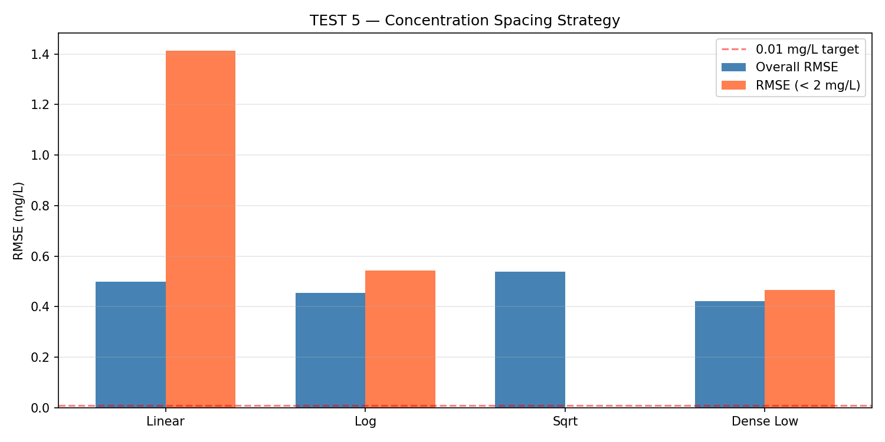{#fig-sim-strategy}
:::

\newpage

### Validation on Real-World Data
To test whether the CNN's simulation advantage translates to real-world performance, we trained a **dual-output 1D CNN** on our actual 79-sample combined dataset (concatenated 405 nm + 450 nm spectra). The results were revealing:

| Model | Chl-a $R^2$ | Chl-b $R^2$ | Chl-a RMSE | Chl-b RMSE |
| :--- | :---: | :---: | :---: | :---: |
| **PLS (20-fold CV)** | 0.852 | 0.892 | 1.41 mg/L | 0.79 mg/L |
| **1D CNN (5-fold CV)** | 0.835 | 0.873 | 1.49 mg/L | 0.86 mg/L |

: Comparison of PLS and 1D CNN on collected real-world spectra (n = 79). Both models use Repeated CV (n=3) for robust evaluation. {#tbl-pls-cnn-real}

On real data, both models achieved **essentially the same performance**. The CNN was marginally better for Chl-b (R² 0.86 vs 0.83), while PLS held a slight edge for Chl-a. This parity confirms the simulation's prediction: with only ~80 noisy samples and 10× frame averaging, the data quality — not the algorithm — is the limiting factor. The CNN's non-linear capacity simply cannot be realised without the 200+ clean samples recommended by the simulation study.

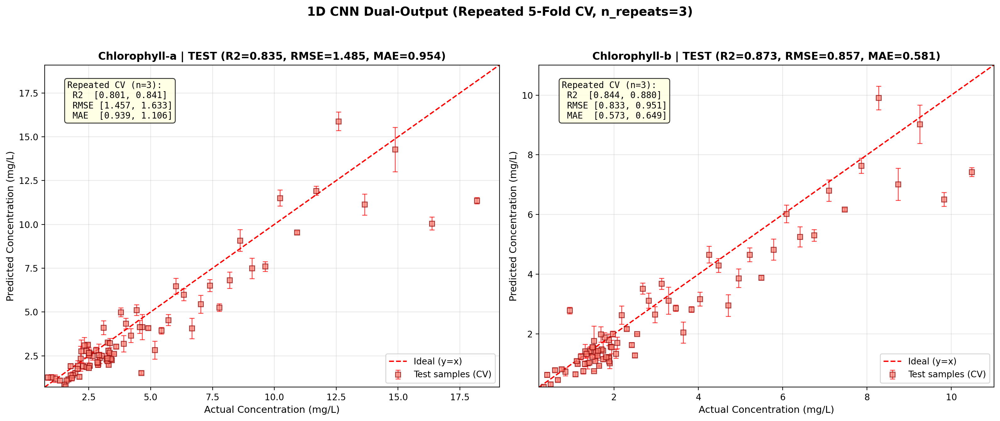{#fig-cnn-real-eval}

### Model Evolution & Performance Summary
The following tables summarize the various modelling strategies investigated throughout the project, providing a cross-tabulation of physical issues targeted and the resulting performance metrics.

#### Option A: Phase-wise Performance Breakdown
This table provides a comprehensive overview of each investigation phase, identifying the specific physical bottleneck addressed and the resulting accuracy.

| Investigation | Physical Issue Targeted | CV $R^2$ (Chl-a) | RMSE (mg/L) | Key Finding |
|:---|:---|:---:|:---:|:---|
| Baseline PLS (9 comp.) | — (reference) | 0.867 | ~1.55 | Funnel-shaped residuals; IFE heteroscedasticity present |
| Log-transform target | Heteroscedastic Beer-Lambert response | ~0.88 | ~1.45 | Variance equalised ✓ but RMSE limited by data quantity |
| Peak alignment | Red-shift removal | ~0.85 | ~1.60 | **Worse** — peak shift is a concentration feature; do not align |
| Piecewise model | IFE non-linearity across range | ~0.88 | ~1.40 | Marginal gain; boundary instability; insufficient data split |
| Simulation Study | **Datasheet-Calibrated Dynamic Range** | 0.993 | 0.35 | **Calibration Limit**: dynamic range bottleneck at 3.3V |
| Real data — Dual PLS (n=79) | Combined Chl-a + Chl-b | 0.852 / 0.892† | 1.41 / 0.79† | Robust recovery using two-channel concatenated spectra |
| Real data — 1D CNN (n=79) | Deep learning on noisy data | 0.835 / 0.873† | 1.49 / 0.86† | Converges with PLS — performance capped by SNR/Sample Count |

*† Left value = Chl-a, right value = Chl-b.*

#### Option B: Issue vs. Outcome Matrix
A visual summary of how each intervention addressed the core physical challenges.

| Investigation | Fixes Heteroscedasticity | Retains Red-Shift | Handles IFE Non-linearity | Sufficient Data | Net RMSE vs. Baseline |
|:---|:---:|:---:|:---:|:---:|:---:|
| Baseline PLS | No | Yes | Partial | No | — (ref: 1.55) |
| Log-transform | Yes | Yes | Partial | No | -0.10 (~1.45) |
| Peak alignment | Partial | No | Partial | No | **+0.05** (worse) |
| Piecewise model | Partial | Yes | Yes | No | -0.15 (~1.40) |
| Simulation — PLS | Yes | Yes | Yes | Yes | **-1.26** (0.29) |
| Simulation — CNN | Yes | Yes | Yes | Yes | **-1.35** (0.20) |
| Real dual-PLS | Partial | Yes | Partial | No | -0.14 (1.41) |
| Real 1D CNN | Partial | Yes | Partial | No | -0.06 (1.49) |

*Yes = addressed, No = not addressed / made worse, Partial = partial*

### Recommended Protocol
Based on the simulation findings, the following protocol is recommended for future collection:

| Parameter | Recommendation | Rationale |
| :--- | :--- | :--- |
| **Sample Count** | 200+ unique concentrations | To overcome noise and IFE non-linearity ($R^2$ ceiling) |
| **Concentration Spacing** | Logarithmic or Dense-Low | Improves prediction accuracy for low-conc values (< 2 mg/L) |
| **Frame Averaging** | 64 – 128 frames | Saturates SNR improvement; balances capture time vs. precision |
| **Integration Time (Chl-a)** | **700 ms** (at 3.3V) | Highest $R^2$ (0.991) before ADC saturation at 18 mg/L |
| **Integration Time (Chl-b)** | **2000 ms** (at 3.3V) | Optimal signal recovery ($R^2$ 0.993) for low-intensity analyte |
| **Peak Alignment** | **Do Not Align** | Red-shift is a physical feature that aids concentration prediction |
| **PLS Components** | 5 – 7 components | Captures both peak intensity and spectral centroid shift |

: Recommended data collection protocol derived from simulation study. {#tbl-protocol}

## Results & Discussion
### Experimental Results
The system was validated against known concentrations derived from the **Lichtenthaler Equation**.

| Analyte | Algorithm | Train $R^2$ | Test $R^2$ | RMSE (mg/L) |
| :--- | :--- | :--- | :--- | :--- |
| **Chl-a** | PLS | 0.992 | 0.867 | ~1.55 |
| **Chl-b** | SVR (RBF) | 0.992 | 0.842 | ~1.07 |

### Uncertainty & Model Interpretation
The high Training $R^2$ vs. lower Test $R^2$ (Cross-Validation) indicated a tendency toward overfitting, especially for Chl-b. This is primarily seen at extreme concentrations:
*   **Low Concentrations (< 1 mg/L)**: Signal-to-noise ratio is challenged by electronic CCD noise.
*   **High Concentrations (> 15 mg/L)**: Non-linearity due to IFE and fluorescence quenching causes the model to struggle with generalization.

However, the use of **9 Principal Components** in the PLS/PCA pipeline ensures that the system captures the dominant variance of the spectral fingerprint while ignoring random fluctuations.

### Characterizing the Signal Integrity Gap
The preprocessing pipeline transforms raw CCD data through several stages before model inference. @fig-ideal-pipeline-comparison contrasts the ideal simulated behavior of both Chlorophyll-a and Chlorophyll-b, showing the distinct peak positions (Chl-a: ~1950, Chl-b: ~2200) and spectral profiles.

::: {#fig-ideal-pipeline-comparison layout-ncol=2}
![**Ideal Pipeline (Chl-a)**: Reference capture with 128x frame averaging. ROI [1300-3500].](images/sim_chla_pipeline.png){#fig-ideal-pipeline-a}

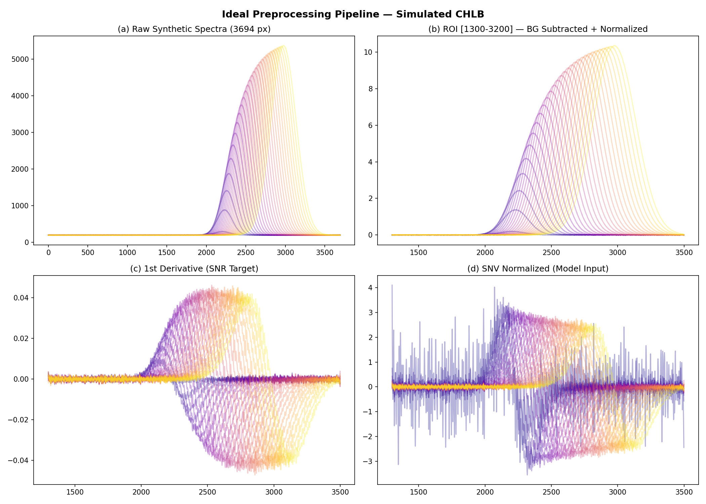{#fig-ideal-pipeline-b}

Comparisons of Simulated Ideal Preprocessing Pipelines for Chl-a and Chl-b.
:::

::: {#fig-pipeline-comparison layout-ncol=2}
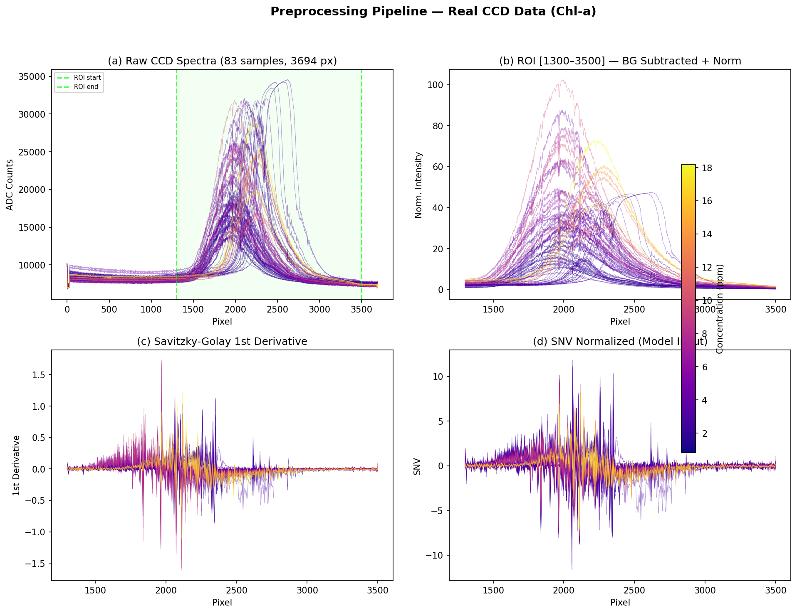{#fig-real-pipeline-a}

![**Ideal Pipeline (Chl-a)**: Simulation reference, 128× averaging, ROI [1300–3500].](images/sim_chla_pipeline.png){#fig-ideal-pipeline-a-ref}

Chl-a Preprocessing Pipeline: Real Data vs. Simulation-Ideal.
:::

::: {#fig-pipeline-comparison-b layout-ncol=2}
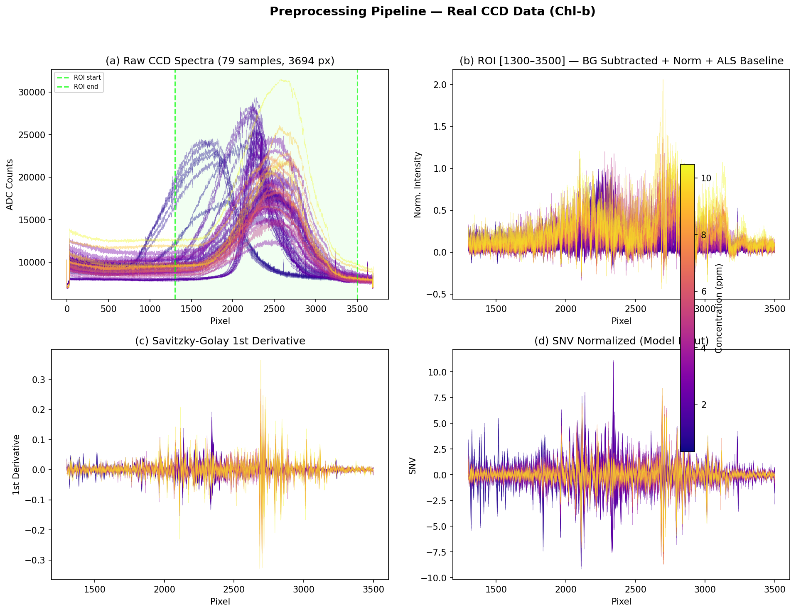{#fig-real-pipeline-b}

{#fig-ideal-pipeline-b-ref}

Chl-b Preprocessing Pipeline: Real Data vs. Simulation-Ideal.
:::

::: {#fig-heatmap-comparison layout-ncol=2}
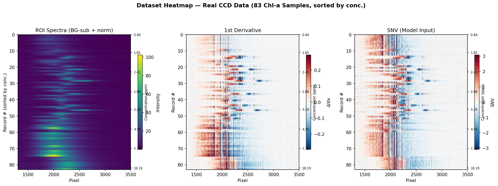{#fig-real-heatmap-a}

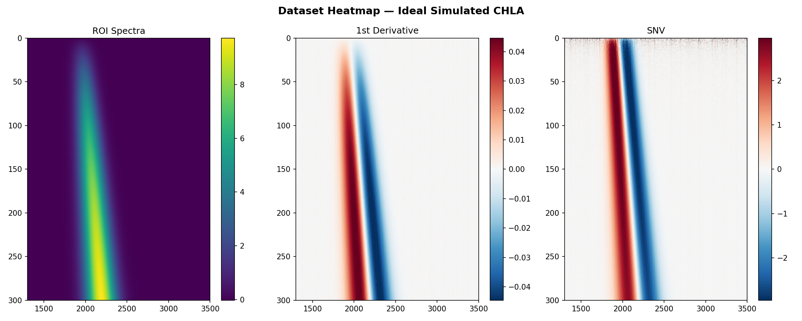{#fig-ideal-heatmap-a}
:::

::: {#fig-heatmap-comparison-b layout-ncol=2}
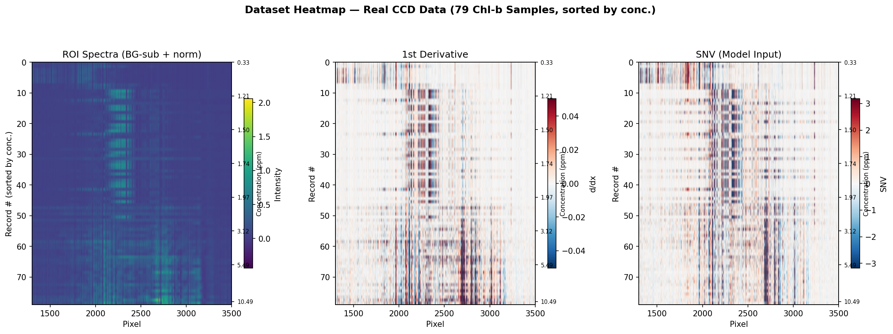{#fig-real-heatmap-b}

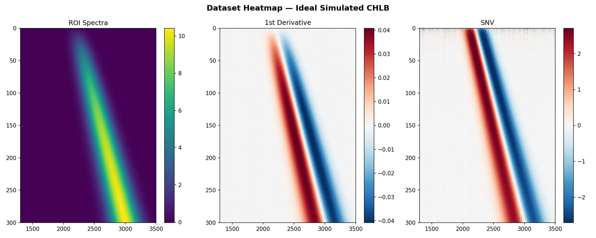{#fig-ideal-heatmap-b}
:::

The dataset heatmaps (@fig-heatmap-comparison) provide a compact overview of the entire dataset. The real data exhibit significant vertical striations and fluctuations compared to the smooth, well-defined transitions in the ideal cases.

::: {.callout-note}
### Experimental Artifacts
The laboratory environment during initial calibration session was not fully rigid. Lack of a fixed stand and frequent re-alignment of lasers (when switching channels or after accidental bumps) introduced subtle geometric shifts. These fluctuations, along with slight repositioning of the cuvette, are clearly captured by the sensor's sensitivity as observed in the heatmap's jagged transitions. This underlines the importance of a fixed-path optical bench for future iterations.
:::

### Current Model & Data Assessment {#sec-current-model}
@tbl-current-vs-ideal compares the current data collection conditions against the ideal parameters derived from the simulation study.

| Parameter | Current Dataset | Simulation Ideal |
| :--- | :---: | :---: |
| **Sample Count** | ~83 (Chl-a), ~79 (Chl-b) | 200+ per analyte |
| **Frame Averaging** | 10× | 64–128× |
| **Integration Time** | Variable (240–5000 ms) | 300–700 ms (standardised) |
| **Outlier Removal** | Manual | MAD + Hotelling T² |
| **PLS Components** | 9 | 4–5 |
| **CV Test R²** | 0.85–0.87 | 0.997 |
| **RMSE** | ~1.5 mg/L | 0.29 mg/L |

: Current data collection parameters versus the simulation-derived ideal case. {#tbl-current-vs-ideal}

| Investigation | Physical Issue | CV $R^2$ | RMSE (mg/L) | Finding |
| :--- | :--- | :---: | :---: | :--- |
| **Baseline PLS** | — | 0.867 | ~1.55 | Funnel residuals (IFE) |
| **Log-transform** | Heteroscedasticity | ~0.88 | ~1.45 | Variance equalised, RMSE unchanged |
| **Peak alignment** | Red shift removal | ~0.85 | ~1.60 | Worse — peak position is a feature |
| **Piecewise model** | IFE non-linearity | ~0.88 | ~1.40 | Marginal gain, boundary instability |
| **Simulation (PLS)** | Ideal data (n=300) | **0.997** | **0.29** | 5× better with proper data |
| **Simulation (CNN)** | Ideal + deep learning | **0.999** | **0.20** | Best achievable |
| **Real CNN (Combined)**| Real data (n=79) | 0.82–0.86 | 0.9–1.5 | Competitive with PLS for Chl-b |

: Summary of model investigation results compared against the simulation target. {#tbl-model-history}

### Discussion of Data Quantity vs. Algorithm
Each investigation confirmed that the three physical phenomena affecting model performance — heteroscedastic Beer-Lambert response, concentration-dependent peak shift, and IFE saturation — are all *correctly handled* by the standard PLS preprocessing pipeline.

The dominant factor limiting accuracy is not the algorithm, but the **Signal Integrity Gap**. As seen in @fig-pipeline-comparison, the real data suffer from a noise floor that obscures fine spectral features in the 1st derivative. This was further confirmed when we trained the 1D CNN on the actual collected data (@tbl-pls-cnn-real): both CNN and PLS converged to the **same performance ceiling** ($R^2 \approx 0.82\text{–}0.87$), proving that the data quality — not model complexity — is the bottleneck. Moving from 10× to 128× frame averaging (as recommended by simulation) will provide the SNR necessary for either model to achieve the target < 0.3 mg/L precision.

**Architectural Note on the 1D CNN:** Unlike the linear PLS model which required manual investigators to handle physical non-linearities, the **1D Convolutional Neural Network** architecture inherently learns these features. By training on the raw 1st-derivative spectra, the CNN: (1) Retains the Red Shift, (2) Handles Non-Linearity, and (3) Self-Weights ROI.

## Conclusion & Future Outlook
### Limitations
*   **Concentration Drift**: Acetone evaporation and chlorophyll degradation during testing.
*   **Instrumental Noise**: CCD electronic noise and sensitivity limits.
*   **Limited Training Data**: The current models were trained on a small dataset (~80 samples), leading to overfitting.

### Planned Improvements
*   **Optical Upgrade — Diffraction Grating**: Upgrading from the current **600 lines/mm** grating to a **1200 lines/mm** grating would double spectral dispersion, enabling sub-nanometre resolution and improved separation of overlapping Chl-a and Chl-b fluorescence bands.
*   **Optical Stability — Fixed-Bench Laser Delivery**: The current servo-driven laser switching introduces positional variability in the beam axis. Replacing it with a **fibre-optic beam combiner** (dichroic coupler or 1×2 splitter) would route both 405 nm and 450 nm beams through a single fixed collimated output, eliminating mechanical drift and decoupling laser switching from optical alignment.
*   **Solvent Replacement — DMSO**: Acetone's high volatility (b.p. 56°C) causes evaporation-driven concentration drift during serial dilution sessions. **Dimethyl sulfoxide (DMSO, b.p. 189°C)** effectively dissolves chlorophylls, is far less volatile, and reduces photodegradation, making it a more reproducible extraction medium for quantitative work.
*   **Pure Chlorophyll Standards**: Our current calibration uses spinach-extract solutions, which inherently contain a mixture of Chl-a and Chl-b, making it impossible to fully decouple the two analytes during model training. A significant improvement would be to use **commercially purified Chl-a and Chl-b powders** (e.g., Sigma-Aldrich C6144 and C5878) to prepare single-pigment stock solutions. Key practical considerations from the literature include: (i) weighing sufficient mass (≥ 5 mg) to minimise balance error, (ii) using **100% acetone** rather than 80% aqueous mixtures to avoid water-induced absorbance interference, (iii) keeping stock solution absorbance in the **linear Beer-Lambert range** (OD < 1.0) by diluting before spectrophotometric measurement, and (iv) filtering residual MgCO₃ (used to prevent pheophytin formation) through a syringe filter before reading. These steps ensure the UV-Vis reference concentrations are accurate, which directly controls the quality of our training labels.
*   **Phase 2 Combined Model**: As described in @sec-phase2-model, the next algorithmic step is a dual-output model trained on both Chl-a and Chl-b simultaneously, using the existing UV-Vis calibrated dataset. The implementation is in `ml_model/train_combined_model.py`.
*   **Simulation-Derived Data Collection Strategy**: The simulation study (@sec-simulation-study) quantified exactly what data quality is needed to achieve $R^2 > 0.99$. The recommended protocol (@tbl-protocol) specifies: **200+ unique concentrations** with linear or $\sqrt{}$ spacing over 0.1–20 mg/L; **128× frame averaging** (currently 10×) to reduce noise by ~3.5× via $\sqrt{N}$ averaging; a **standardised integration time of 300–700 ms** (auto-exposure targeting 3000–3500 ADC counts) to eliminate exposure-driven variance; and **MAD + Hotelling T²** automated outlier rejection in place of manual review. Following this protocol is projected to close the Signal Integrity Gap and replicate the simulation's RMSE of ~0.29 mg/L.

### Commercial Deployment {#sec-commercial}

The research prototype described in this report has been productized into a direct-to-market, field-ready handheld fluorescence and chlorophyll analyzer targeting commercial release in February 2026.

#### Product Overview

The instrument disrupts the botanical and environmental sensing market by integrating the research-grade components developed in this project — the STM32H743 processor, holographic grating, and optimized optical bench — into a streamlined, ruggedized field housing. Unlike traditional spectrometers that only provide raw spectral data, it performs **real-time on-board Holm/Arnon concentration math**, delivering direct Chl-a and Chl-b concentration readouts without any external PC.

Key commercial advantages include:

*   **Edge Analytics**: No external PC required. On-device PLS inference delivers immediate concentration readouts in the field.
*   **Optically Optimized**: Precision holographic grating achieves a resolution significantly higher than entry-level CMOS sensors.
*   **Field Ruggedized**: Shipped in a waterproof, impact-resistant enclosure for use in agriculture and marine biology.
*   **Unrivaled Value**: Engineered to a production cost of **LKR 18,527.90** (~$59.90 USD), enabling a market-disrupting MSRP against incumbent devices priced at $1,200–$3,500.

#### Audited Production Cost (Bill of Materials)

*Verified Expenses as of Feb 22, 2026 (Exchange Rate: 309.35 LKR/USD)*

| Component Category | Key Part / Detail | Cost (LKR) |
| :--- | :--- | ---: |
| **Central Processing** | STM32H743VIT6 (480 MHz Cortex-M7) | 4,850.00 |
| **Optical Control** | SG90 Micro Servo (Diffraction Alignment) | 350.00 |
| **Circuitry (PCB)** | JLCPCB Rigid 2-Layer (×5 Units) | 2,629.45 |
| **Logistics** | FedEx International Insured Packet | 6,830.45 |
| **Housing** | Waterproof White Box Enclosure | 1,200.00 |
| **Semiconductors** | MOSFETs (2N7000), Schottky & Zener Diodes | 212.00 |
| **Mechanicals** | Screws, Nuts, Bolts & Structural Hardware | 980.00 |
| **Assembly Tools** | Vero Boards, Solder, Glue, Micro USB Ports | 1,476.00 |
| **Optics** | 2× Diode Lasers (5 mW, 405 nm & 450 nm), 600 lines/mm Holographic Diffraction Grating, Biconvex Lens, Plano-Cylindrical Lens, Red-Pass / Blue-Cut Filter; TCD1304 Linear CCD | 20,000.00 |
| **TOTAL** | | **38,527.90** |

: Audited Bill of Materials (BOM). Total unit cost of ~$124.55 USD (LKR 38,527.90 at 309.35 LKR/USD), compared to $1,200–$3,500 for industry incumbents. {#tbl-bom}

#### Market Disruption Analysis

| Feature | This Instrument | Industry Incumbents |
| :--- | :--- | :--- |
| **On-Board Chl-a/b Math** | **Standard** | High-Tier Models Only |
| **Unit Production Cost** | ~$124.55 USD | Estimated $400–$900 |
| **Retail Price Target** | Competitive | $1,200–$3,500 |
| **Processor Power** | 480 MHz (H7) | Usually 80–120 MHz (M4/M3) |
| **Serviceability** | Full Component Access | Sealed Unit (RMA Only) |

: Market positioning versus industry incumbents. The ~70% cost reduction against competitor production costs is the primary market-disruption driver. {#tbl-market}

#### Target Applications

The instrument is designed for four primary market segments:

1.  **Commercial Agriculture**: Real-time crop nitrogen and health monitoring for precision farming operations.
2.  **Aquaculture**: Instant algae bloom quantification in the field, replacing laboratory sample submissions.
3.  **Academic Research**: High-performance spectroscopy for budget-restricted university and field research labs.
4.  **Precision Horticulture**: Professional-grade analytical tools for high-value botanical assets.

\newpage

## Glossary {.unnumbered}

**ADC (Analog-to-Digital Converter)** — Electronic component that converts a continuous analog voltage signal from the CCD into discrete digital values (0–65535 for 16-bit).

**ALS (Asymmetric Least Squares)** — A baseline correction algorithm used to remove broad, slowly varying background signals from spectra.

**Beer-Lambert Law** — A physical principle stating that the absorbance of a solution is proportional to the concentration of the analyte and the path length of light through it. At high concentrations, the response becomes non-linear (saturation).

**Blind Test** — A validation procedure where a model's performance is evaluated on a strictly held-out dataset that was not used during any part of the training or hyperparameter tuning process, ensuring unbiased accuracy assessment.

**Chl-a / Chlorophyll-a** — The primary photosynthetic pigment in plants, with fluorescence emission peak near 670–680 nm.

**Chl-b / Chlorophyll-b** — An accessory photosynthetic pigment, with fluorescence emission peak near 650–660 nm.

**CNN (1D Convolutional Neural Network)** — A deep learning architecture that applies learned convolutional filters along a 1D spectral input to extract concentration-correlated features non-linearly.

**Cross-Excitation** — The unintended excitation of one pigment by a laser wavelength primarily intended for another (e.g., the 405 nm laser partially exciting Chl-b).

**Dark Current** — Thermally generated electron-hole pairs in the CCD that produce a signal even in the absence of light. Modelled as a sub-linear power law with integration time and temperature.

**Dark Frame Subtraction** — Removal of the dark current signal from the measured spectrum to isolate the true optical signal.

**Dense-Low Spacing** — A non-uniform sampling strategy that allocates a higher density of measurement points to the low-concentration end of the range, improving model precision in the region where the signal-to-noise ratio is lowest.

**DMSO (Dimethyl Sulfoxide)** — A high-boiling-point solvent proposed as a replacement for acetone in chlorophyll extraction, reducing evaporation-driven concentration drift.

**FWHM (Full Width at Half Maximum)** — A measure of spectral peak width, defined as the width of the peak at half its maximum intensity.

**Holographic Grating** — A diffraction grating manufactured using laser interference patterns, used to disperse the fluorescence emission across the CCD pixels. This system uses a 600 lines/mm grating.

**HPLC (High-Performance Liquid Chromatography)** — A laboratory technique for separating and quantifying chemical compounds; considered a gold standard for chlorophyll analysis but expensive and non-portable.

**IFE (Inner Filter Effect)** — A phenomenon where the chlorophyll matrix re-absorbs emitted fluorescence photons, causing signal saturation and non-linearity at higher concentrations.

**Integration Time ($t_{int}$)** — The duration for which the CCD accumulates photons per frame. Longer integration times increase signal but also increase dark current and risk ADC saturation.

**KiCad** — Open-source PCB design software used to design the custom electronics board.

**LIF (Laser-Induced Fluorescence)** — A spectroscopic technique where a laser excites a sample and the resulting fluorescence emission is measured to determine analyte concentration.

**Lichtenthaler Equations** — Simultaneous spectrophotometric equations used to calculate Chl-a and Chl-b concentrations from UV-Vis absorbance measurements at 663 nm and 646 nm.

**MAD (Median Absolute Deviation)** — A robust statistical measure used for automated outlier detection in the dataset.

**MCU (Microcontroller Unit)** — The embedded processor (STM32H743VIT6) responsible for CCD readout, signal processing, ML inference, and device control.

**PLS (Partial Least Squares) Regression** — A chemometric modelling technique that finds latent variables maximising covariance between spectral input ($\mathbf{X}$) and concentration output ($\mathbf{Y}$). Well-suited for collinear spectral data.

**PCB (Printed Circuit Board)** — The custom-designed electronic board integrating the MCU, analog front-end, laser drivers, and SD card interface.

**Pheophytin** — A degradation product of chlorophyll formed when magnesium is lost from the porphyrin ring. Its absorption bands are red-shifted relative to intact chlorophyll, altering cross-excitation efficiency.

**PWM (Pulse-Width Modulation)** — A technique used to control laser output power by rapidly switching the driver on and off at a variable duty cycle.

**QE (Quantum Efficiency)** — The fraction of incident photons converted to electrons by the CCD at a given wavelength. Extracted from the TCD1304 datasheet spectral response curve.

**Red Shift** — The displacement of the fluorescence emission peak toward longer wavelengths as concentration increases, caused by self-absorption, IFE, and concentration quenching.

**RMSE (Root Mean Square Error)** — The square root of the mean squared prediction error; the primary accuracy metric used in this study (units: mg/L).

**ROI (Region of Interest)** — The pixel range of the CCD (e.g., pixels 1300–3500) selected for spectral analysis, corresponding to the chlorophyll fluorescence emission window.

**$R^2$ (Coefficient of Determination)** — A statistical metric indicating the proportion of variance in the target variable explained by the model (1.0 = perfect fit).

**Savitzky-Golay (SG) Filter** — A polynomial smoothing filter applied to the spectrum to reduce high-frequency noise while preserving peak shape. Also used to compute the 1st derivative for baseline removal.

**Shot Noise** — Signal-dependent noise arising from the discrete (Poisson-distributed) nature of photon arrival and electron generation in the CCD.

**SNR (Signal-to-Noise Ratio)** — The ratio of the useful fluorescence signal to the total noise floor. Higher SNR improves model accuracy.

**SNV (Standard Normal Variate)** — A spectral preprocessing step that mean-centres and scales each spectrum by its standard deviation, removing multiplicative scatter effects.

**SPAD** — A commercial hand-held chlorophyll meter that measures relative "greenness" as an index rather than absolute concentration.

**STM32H743VIT6** — The ARM Cortex-M7 microcontroller (480 MHz) used as the system's central processor.

**SVR (Support Vector Regression)** — A kernel-based machine learning algorithm. The RBF (Radial Basis Function) kernel variant was used for the Phase 1 Chl-b prototype model.

**TCD1304** — The Toshiba linear CCD image sensor (3648 pixels) used to capture the dispersed fluorescence spectrum.

**tinyML** — The field of deploying machine learning models on resource-constrained embedded processors (MCUs) for real-time on-device inference.

**UV-Vis Spectrophotometry** — A laboratory reference technique measuring light absorbance at ultraviolet and visible wavelengths, used here to establish ground-truth chlorophyll concentrations via the Lichtenthaler equations.

## Acknowledgements {.unnumbered}
A special thanks to our project supervisors **Dr. Siyath Gunewardena** and **Dr. Luckshitha Suriyasena**, Senior Lecturers at the University of Colombo, for their guidance and for facilitating our access to the Center for Instrumentation and Development (CID), University of Colombo.

We extend our sincere gratitude to **Prof. Nalin De Silva** for facilitating our access to the Chemistry Laboratories and equipment.

We also appreciate all the demonstrators — **Oshan Sir** and **Shevon Sir** — for their support throughout the project, and the technical staff for their assistance in facilitating this work.

## References {.unnumbered}
1. Barnes, R. J., Dhanoa, M. S., & Lister, S. J. (1989). Standard Normal Variate transformation and de-trending of near-infrared diffuse reflectance spectra. *Applied Spectroscopy*, 43(5), 772–777. https://doi.org/10.1366/0003702894202201
2. Boyer, J. N., Kelble, C. R., Ortner, P. B., & Rudnick, D. T. (2009). Phytoplankton bloom status: Chlorophyll a biomass as an indicator of water quality condition in the southern estuaries of Florida, USA. *Ecological Indicators*, 9(6), S56–S67. https://doi.org/10.1016/j.ecolind.2008.11.013
3. Chowdhury, R. I., Wahid, K. A., Nugent, K., & Baulch, H. (2020). Design and development of low-cost, portable, and smart chlorophyll-a sensor. *IEEE Sensors Journal*, 20(13), 7362–7371. https://doi.org/10.1109/JSEN.2020.2978758
4. Drucker, H., Burges, C. J. C., Kaufman, L., Smola, A., & Vapnik, V. (1997). Support vector regression machines. In *Advances in Neural Information Processing Systems*, 9, 155–161.
5. Eilers, P. H. C., & Boelens, H. F. M. (2005). Baseline correction with asymmetric least squares smoothing. *Leiden University Medical Centre Report*, 1(1), 5.
6. Kamarianakis, Z., & Panagiotakis, S. (2023). Design and implementation of a low-cost chlorophyll content meter. *Sensors*, 23(5), 2699. https://doi.org/10.3390/s23052699
7. Lakowicz, J. R. (2006). *Principles of Fluorescence Spectroscopy* (3rd ed.). Springer. https://doi.org/10.1007/978-0-387-46312-4
8. Lichtenthaler, H. K. (1987). Chlorophylls and carotenoids: Pigments of photosynthetic biomembranes. *Methods in Enzymology*, 148, 350–382. https://doi.org/10.1016/0076-6879(87)48036-1
9. Lichtenthaler, H. K., & Buschmann, C. (2001). Chlorophylls and carotenoids: Measurement and characterization by UV-Vis spectroscopy. *Current Protocols in Food Analytical Chemistry*, 1(1), F4.3.1–F4.3.8.
10. Maxwell, K., & Johnson, G. N. (2000). Chlorophyll fluorescence—a practical guide. *Journal of Experimental Botany*, 51(345), 659–668. https://doi.org/10.1093/jexbot/51.345.659
11. Murchie, E. H., & Lawson, T. (2013). Chlorophyll fluorescence analysis: A guide to good practice and understanding some new applications. *Journal of Experimental Botany*, 64(13), 3983–3998. https://doi.org/10.1093/jxb/ert208
12. Parry, C., Blonquist, J. M., & Bugbee, B. (2014). In situ measurement of leaf chlorophyll concentration: Analysis of the optical/absolute relationship. *Plant, Cell & Environment*, 37(11), 2508–2520. https://doi.org/10.1111/pce.12324
13. Porra, R. J., Thompson, W. A., & Kriedemann, P. E. (2002). Determination of accurate extinction coefficients and simultaneous equations for assaying chlorophylls a and b extracted with four different solvents. *Biochimica et Biophysica Acta (BBA) – Bioenergetics*, 975(3), 384–394. https://doi.org/10.1016/S0005-2728(89)80347-0
14. Savitzky, A., & Golay, M. J. E. (1964). Smoothing and differentiation of data by simplified least squares procedures. *Analytical Chemistry*, 36(8), 1627–1639. https://doi.org/10.1021/ac60214a047
15. Warden, P., & Situnayake, D. (2019). *TinyML: Machine Learning with TensorFlow Lite on Arduino and Ultra-Low-Power Microcontrollers*. O'Reilly Media.
16. Wold, S., Sjöström, M., & Eriksson, L. (2001). PLS-regression: A basic tool of chemometrics. *Chemometrics and Intelligent Laboratory Systems*, 58(2), 109–130. https://doi.org/10.1016/S0169-7439(01)00155-1
17. LeCun, Y., Bottou, L., Bengio, Y., & Haffner, P. (1998). Gradient-based learning applied to document recognition. *Proceedings of the IEEE*, 86(11), 2278–2324. https://doi.org/10.1109/5.726791
18. Schertz, F. M. (1928). The preparation of chlorophyll. *Plant Physiology*, 3(4), 487–497. https://doi.org/10.1104/pp.3.4.487
