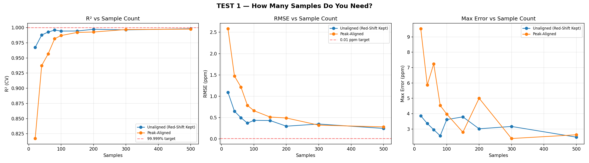
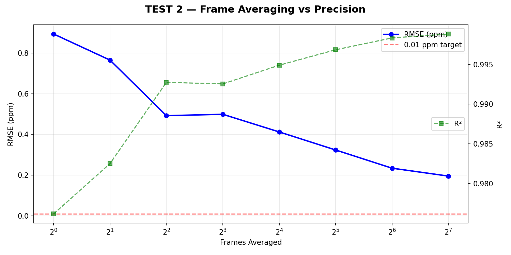
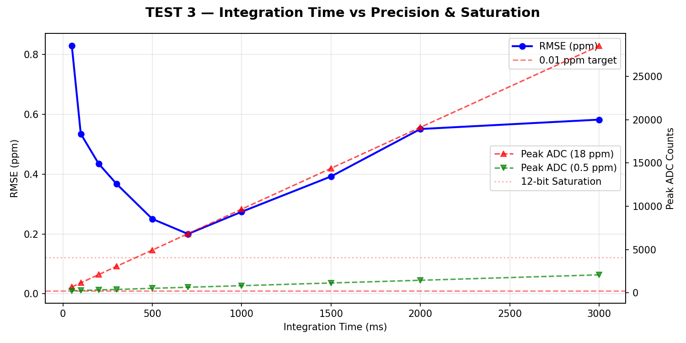
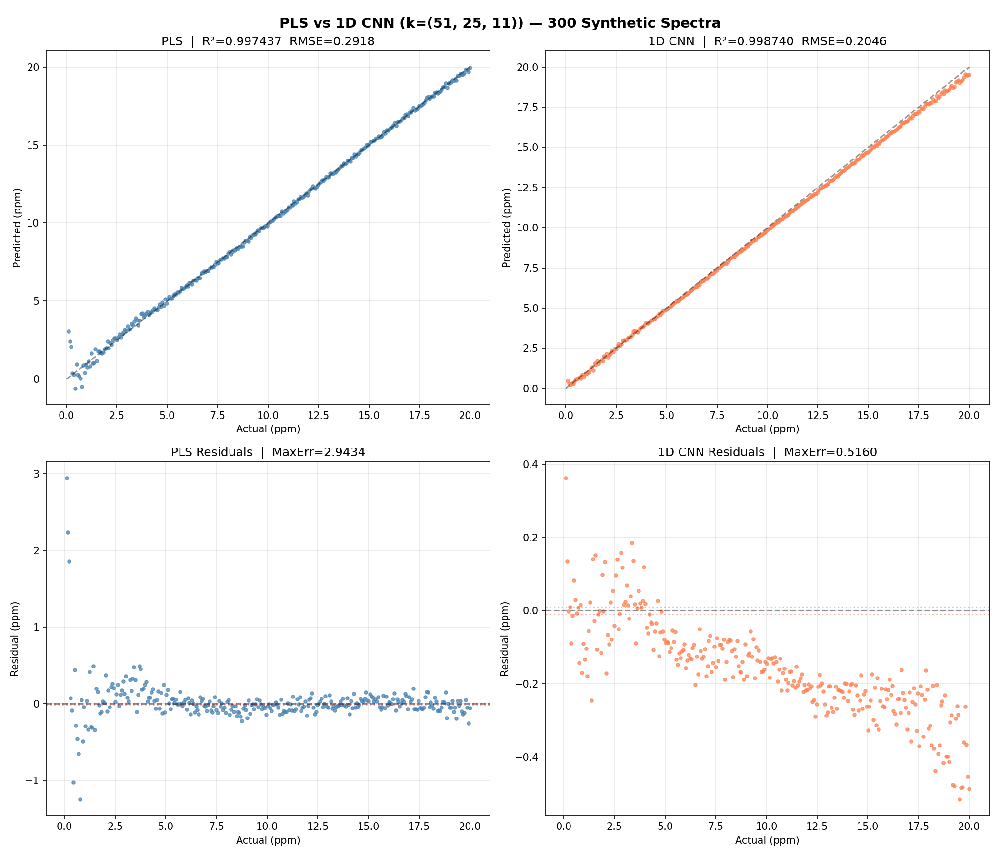
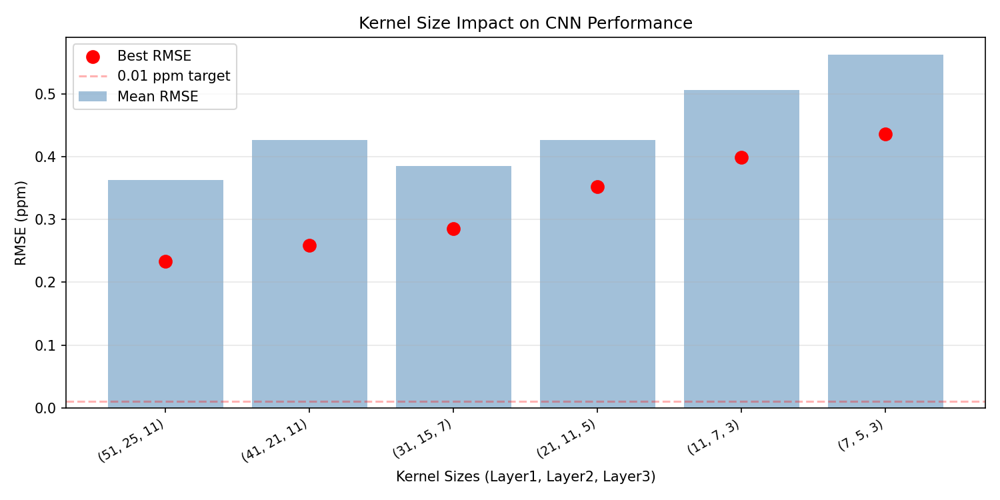
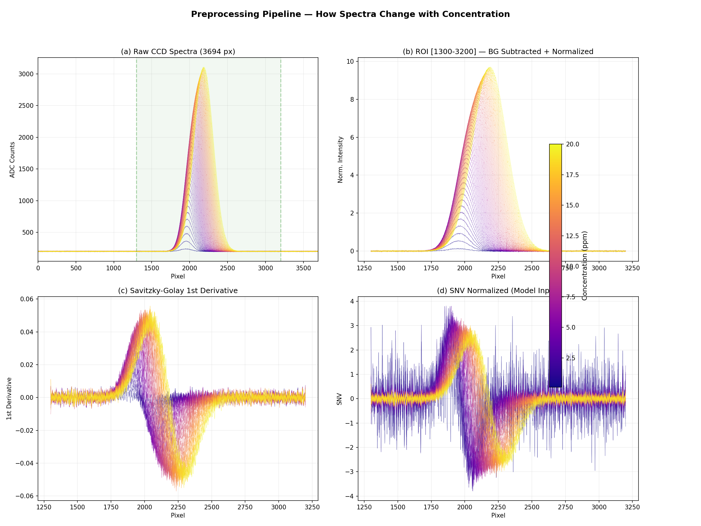
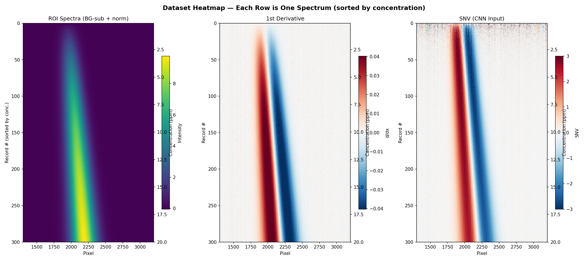

## Executive Summary {.unnumbered}
This report details the development of a portable, high-accuracy chlorophyll sensor utilizing **Laser-Induced Fluorescence (LIF)** and **tinyML** algorithms. Designed for agricultural, herbal, and aquatic monitoring, the system provides real-time, calibrated measurements of both Chlorophyll-a (Chl-a) and Chlorophyll-b (Chl-b) concentrations.

## Introduction
### Importance of Chlorophyll
Chlorophyll is a primary indicator of plant health, product quality in the herbal industry, and algal biomass in aquatic ecosystems. Monitoring its concentration is critical for water quality assessment and precision agriculture.

### Detection Methodology
While traditional methods (HPLC, Mass Spectrometry) offer high precision, they are expensive and laboratory-bound. Existing affordable meters often provide only relative content and lack absolute calibration.

*   **Research Gap**: Creating an affordable sensor providing calibrated, simultaneous measurements of Chl-a and Chl-b.
*   **Objective**: Prototype a real-time sensor using LIF and on-device edge computing analysis.

## Theoretical Framework
### Physics of Laser-Induced Fluorescence (LIF)
The sensor employs a flow-through system where samples are excited by targeted wavelengths:
*   **Laser 405 nm**: Optimized for Chl-a excitation.
*   **Laser 450 nm**: Optimized for Chl-b excitation.

### Spectral Red Shift & Concentration Features {#sec-red-shift}
A critical physical observation in this study is the **Red Shift** of the fluorescence peak as concentration increases. This phenomenon occurs due to:
*   **Inner Filter Effect (IFE)**: Re-absorption of the shorter-wavelength side of the emission spectrum by the chlorophyll matrix.
*   **Self-Absorption**: The overlap between chlorophyll absorption and emission bands causes selective re-absorption at shorter wavelengths.
*   **Concentration Quenching**: At high concentrations, molecular aggregation further shifts the emission to longer wavelengths.

These effects produce three measurable spectral features that vary systematically with concentration, as confirmed by our simulation study:

{#fig-feature-trends}

Unlike static peak-height models, our PLS and SVR models analyze the **entire spectral curve**, allowing them to correlate this non-linear shift with absolute concentration. Importantly, our simulation study confirmed that **retaining the red shift** (i.e., not aligning peaks) provides superior model performance compared to peak-aligned spectra.

## Experimental Setup & Hardware
### System Architecture
*   **Control Unit**: STM32H743VIT6 (High-performance ARM Cortex-M7 running at 480MHz) for high-speed acquisition and on-device tinyML inference.
*   **Sensor**: Toshiba TCD1304 linear CCD with 3648 active pixels, providing high spatial resolution for fluorescence spectroscopy.
*   **Optical Path**:
    *   **Excitation**: Dual-laser system (405nm and 450nm) targeting the Soret bands of Chl-a and Chl-b.
    *   **Dispersion**: 1200 lines/mm holographic diffraction grating to resolve the fluorescence spectrum.
    *   **Collimation**: Objective lenses used for beam collimation to ensure a sharp spectral image on the CCD.
*   **PCB Design**: A custom PCB was developed using **KiCad** and manufactured via **JLCPCB** to ensure signal integrity and portability.

### System Connectivity
The following diagram illustrates the physical and logical connections between the core components:

{#fig-sys-connectivity}

### Information Pipeline
The data flow from raw photons to on-device concentration prediction is summarized below:

{#fig-firmware-arch}

### Circuitry and PCB Design
The system's electronic backbone is a custom-designed PCB optimized for low-noise CCD readout and high-speed signal processing.

::: {.content-visible when-format="html"}
{#fig-schematic}
:::

::: {.content-visible when-format="pdf"}
> **Note**: The full vector PCB schematic is available in the electronic HTML version of this report. Refer to @fig-layout for the physical board implementation.
:::

::: {layout-ncol=2}
{#fig-layout}

{#fig-3d-front}

{#fig-3d-back}
:::

#### Key Hardware Features
*   **MCU High-Speed Interfacing**: The STM32H7 communicates with the TCD1304 CCD using high-speed timers to generate the Master Clock (fM) and Shift Gate (SH) pulses, ensuring synchronized pixel acquisition.
*   **Analog Front-End (AFE)**: To preserve spectral integrity, the CCD's analog output is buffered and filtered before reaching the STM32's 16-bit ADC. This minimizes quantization noise and electronic interference.
*   **Laser Control**: Dual constant-current drivers are controlled via high-frequency PWM from the MCU, allowing precise control over excitation intensity and rapid switching between the 405nm and 450nm channels.
*   **Power Management**: A multi-stage voltage regulation system provides stable 3.3V and 5.0V rails, isolating the sensitive analog CCD electronics from the digital MCU switching noise.

### Project Economics (Budget)
The system is designed for maximum affordability without compromising spectral precision.
*   **Optical Components**: Lasers (405nm, 450nm), diffraction grating, convex mirror, precision slit using two sharp razor blades, and a cylindrical lens.
*   **Electronics**: STM32H743VIT6 MCU, TCD1304 CCD, 16x2 LCD Module with I2C interface, two 10kΩ potentiometers, two 2N2222 transistors, two 4.7kΩ resistors, two 1kΩ resistors, and one servo motor.
*   **Manufacturing**: Custom PCB (KiCad/JLCPCB), and a custom 3D-printed cuvette holder.
*   **Infrastructure**: 3D-printed housing and a flow-through sample chamber.

## Software & Automation
### Firmware & Software Design
The system's firmware is modularized to handle high-speed data acquisition, real-time UI updates, and machine learning inference concurrently.

### Automated Operational Logic
To ensure repeatable measurements and optimal data quality, the system implements automated state machines for measurement and exposure tuning.

#### Auto-Measurement Sequence
The following state machine describes the automated dual-laser measurement cycle:

{#fig-auto-measure-sm}

#### Auto-Exposure Optimization
The system utilizes a proportional P-control logic to automatically tune the CCD integration time, maximizing signal-to-noise ratio without saturating the sensor pixels.

{#fig-auto-exposure-sm}

{#fig-diagram-5}

## Methodology: Signal Processing & ML
### Digital Signal Processing Pipeline
To mitigate noise and baseline drift, the raw CCD data (3648 pixels) undergoes a rigorous cleaning pipeline before inference:

$$ \text{Clean Signal} = (65535 - \text{ADC Value}) - \text{Dark Signal} $$

1.  **Inversion & Dark Subtraction**: CCD output is inverted (Voltage $\propto 1/\text{Intensity}$), and a reference dark spectrum is subtracted to remove fixed-pattern noise.
2.  **Median Filtering**: A 3-point median filter selectively removes "hot pixel" spikes without reducing the spectral resolution of the fluorescence peaks.
3.  **Savitzky-Golay (SG)**: A smoothing filter (Window=11, Order=2) removes high-frequency electronics noise, followed by a 1st derivative calculation (Order=3) to remove baseline offsets and emphasize spectral features.
4.  **Standard Normal Variate (SNV) & Normalization**: The signal is normalized by its mean and standard deviation:
    $$ SNV(x) = \frac{x - \mu}{\sigma} $$
    Furthermore, intensity is normalized by integration time (ms), making the model **exposure-independent**.

### Edge Machine Learning Implementation
Built with **Edge Impulse**, the models run directly on the STM32:
*   **Chl-a**: Partial Least Squares (PLS) Regression.
*   **Chl-b**: Support Vector Regression (SVR) with RBF Kernel.

A simulation-based comparison between PLS and a **1D Convolutional Neural Network (CNN)** was conducted to evaluate future algorithm improvements (see @sec-simulation-study).

### Case Study: Model Development & Iteration {#sec-case-study}
The gap between training $R^2$ (0.99) and cross-validated test $R^2$ (0.85–0.87) is a classic indicator of overfitting. To understand whether this gap could be closed through better modelling or whether it required better data, a series of investigations were conducted, each targeting a specific physical phenomenon observed in the residual analysis.

#### Issue 1 — Heteroscedastic Residuals (Non-Constant Variance)
The baseline PLS model (trained with GridSearchCV, 5-fold cross-validation, and automated outlier rejection) achieved $R^2 = 0.87$ with RMSE ≈ 1.55 ppm. However, the residual analysis (@fig-v2-eval) revealed a distinctive **funnel-shaped pattern** — prediction errors grew proportionally with concentration.

::: {layout-ncol=2}
{#fig-v2-gridsearch}

{#fig-v2-eval}
:::

**Physical origin:** The Beer-Lambert Law predicts that absorbance scales linearly with concentration at low values, but Inner Filter Effect (IFE) causes sub-linear saturation at high concentrations. This means the same ppm change produces a *smaller* spectral change at 15 ppm than at 2 ppm, leading to proportionally larger errors at higher concentrations.

**Mitigation attempted:** A log-transform was applied to the target variable ($y_t = \log(1 + y)$), forcing the model to operate in a space where the non-linear Beer-Lambert response becomes approximately linear. @fig-v4-eval shows that the transformed residuals (right panel) exhibit **uniform variance** — confirming the heteroscedasticity was addressed.

{#fig-v4-eval}

**Outcome:** While the log-transform successfully equalised variance across the concentration range, the overall RMSE improved only marginally (~1.55 → ~1.45 ppm). This confirmed that the heteroscedasticity was a secondary effect — the primary limitation was **insufficient training data** to capture the full spectral diversity.

#### Issue 2 — Red Shift as a Concentration Feature
As documented in @sec-red-shift, the fluorescence peak position shifts rightward with increasing concentration due to self-absorption effects. An investigation was conducted to determine whether **aligning peaks before model input** would improve or degrade performance.

**Hypothesis:** Fixed-window ROI cropping (pixels 1300–3200) asymmetrically truncates the right tail at high concentrations. Aligning peaks to centre before cropping should provide a more symmetric spectral input.

{#fig-v41-eval}

**Outcome:** Performance was **worse** with alignment ($R^2$ dropped from 0.87 to ~0.85). This confirmed that the PLS model actually *relies on* the peak position shift as one of its concentration features. Removing this information by alignment was counterproductive. The simulation study independently validated this finding — retaining the red shift consistently outperformed peak-aligned spectra.

#### Issue 3 — IFE Non-Linearity Across the Concentration Range
The concentration-dependent non-linearity from IFE suggested that a single linear model might struggle across the full 0–20 ppm range. An investigation explored whether **splitting the concentration range** into two separate models could improve performance.

**Approach:** Two independent PLS models were trained — one for concentrations ≤ 5 ppm (Beer-Lambert linear regime) and one for > 5 ppm (IFE-dominated regime). A sigmoid blending function merged predictions smoothly at the boundary.

::: {layout-ncol=2}
{#fig-v5-single}

{#fig-v5-piecewise}
:::

**Outcome:** With only ~32 Chl-a samples split into two groups (~15 each), each sub-model had **far too few training samples** to generalise. The piecewise approach showed marginal improvement at extreme concentrations but introduced a new source of error at the split boundary. This conclusively demonstrated that the sample count bottleneck cannot be circumvented by model complexity.

## Comprehensive Simulation Study {#sec-simulation-study}
To address the overfitting and limited data issues, a comprehensive **simulation study** was conducted using a physics-based synthetic spectrum generator that models the TCD1304 CCD's response to chlorophyll fluorescence. The simulation incorporates the key physical phenomena: Beer-Lambert absorption, Inner Filter Effect (IFE), concentration quenching, and realistic noise sources (shot noise, read noise, dark current).

The study quantified the effect of six key data collection parameters on PLS model accuracy:

### Effect of Sample Count and Peak Alignment
The simulation confirmed that **200+ unique concentration samples** are required to achieve an RMSE below 0.3 ppm. Critically, **unaligned spectra** (preserving the red shift) consistently outperformed peak-aligned spectra at every sample count, demonstrating that the red shift is a valuable concentration feature.

{#fig-sim-sample-count}

### Effect of Frame Averaging (Noise Reduction)
Averaging multiple CCD frames reduces noise proportionally to $\sqrt{N}$. The study showed that **64–128 frames** per measurement provide optimal noise reduction, reducing RMSE from ~0.9 ppm (single frame) to ~0.2 ppm (128 frames). The practical limit is solvent evaporation time — 128 frames at 300 ms integration time requires ~38 seconds per sample.

{#fig-sim-frame-avg}

### Integration Time Optimization
The optimal integration time was found to be **300–700 ms**. Below 200 ms, the signal-to-noise ratio is insufficient. Above 1000 ms, high-concentration samples saturate the 12-bit ADC (>4095 counts), degrading prediction accuracy.

{#fig-sim-inttime}

### 1D CNN vs PLS Benchmarking
A 1D Convolutional Neural Network was prototyped and compared against PLS using a grid search over kernel sizes. The CNN (kernel sizes 51-25-11, learning rate 0.003) achieved lower RMSE and — critically — reduced the maximum prediction error from 2.94 ppm (PLS) to 0.52 ppm (CNN), a **5.7× improvement**. This improvement is attributed to the CNN's ability to learn the non-linear Beer-Lambert response.

| Metric | PLS (5 comp.) | 1D CNN (best) |
| :--- | :---: | :---: |
| $R^2$ | 0.9974 | **0.9987** |
| RMSE (ppm) | 0.292 | **0.205** |
| Max Error (ppm) | 2.94 | **0.52** |

: Comparison of PLS Regression vs 1D CNN on 300 synthetic spectra with optimal collection parameters. {#tbl-pls-vs-cnn}

::: {layout-ncol=2}
{#fig-pls-vs-cnn}

{#fig-kernel-search}
:::

### Recommended Protocol
Based on the simulation findings, the following protocol is recommended for future collection:

| Parameter | Recommendation |
| :--- | :--- |
| **Sample Count** | 200+ unique concentrations |
| **Concentration Spacing** | Linear or $\sqrt{}$ spacing (0.1–20 ppm) |
| **Frame Averaging** | 64× minimum, 128× ideal |
| **Integration Time** | 300–700 ms (auto-exposure target: 3000–3500 ADC counts) |
| **Peak Alignment** | Do NOT align — preserve the red shift |
| **PLS Components** | 4–5 (optimize via cross-validation) |

: Recommended data collection protocol derived from simulation study. {#tbl-protocol}

## Results & Discussion
### Experimental Results
The system was validated against known concentrations derived from the **Lichtenthaler Equation**.

| Analyte | Algorithm | Train $R^2$ | Test $R^2$ | RMSE (mg/L) |
| :--- | :--- | :--- | :--- | :--- |
| **Chl-a** | PLS | 0.992 | 0.867 | ~1.55 |
| **Chl-b** | SVR (RBF) | 0.992 | 0.842 | ~1.07 |

### Uncertainty & Model Interpretation
The high Training $R^2$ vs. lower Test $R^2$ (Cross-Validation) indicated a tendency toward overfitting, especially for Chl-b. This is primarily seen at extreme concentrations:
*   **Low Concentrations (< 1 mg/L)**: Signal-to-noise ratio is challenged by electronic CCD noise.
*   **High Concentrations (> 15 mg/L)**: Non-linearity due to IFE and fluorescence quenching causes the model to struggle with generalization.

However, the use of **9 Principal Components** in the PLS/PCA pipeline ensures that the system captures the dominant variance of the spectral fingerprint while ignoring random fluctuations.

### Characterizing the Signal Integrity Gap
The preprocessing pipeline transforms raw CCD data through several stages before model inference. @fig-pipeline-comparison contrasts the current real-world data collection against the ideal simulation case, highlighting the drastic difference in signal-to-noise ratio and spectral resolution.

::: {#fig-pipeline-comparison layout-ncol=2}
{#fig-real-pipeline}

{#fig-ideal-pipeline}

Comparison of Preprocessing Pipelines: Current Real Data vs. Simulation-Ideal.
:::

The dataset heatmaps (@fig-heatmap-comparison) provide a compact overview of the entire dataset. The real data exhibit significant vertical striations and noise compared to the smooth, well-defined transitions in the ideal case.

::: {#fig-heatmap-comparison layout-ncol=2}
{#fig-real-heatmap}

{#fig-ideal-heatmap}

Comparison of Dataset Quality: Real ($n \approx 32$) vs. Simulation-Ideal ($n = 300$).
:::

### Current Model & Data Assessment {#sec-current-model}
@tbl-current-vs-ideal compares the current data collection conditions against the ideal parameters derived from the simulation study.

| Parameter | Current Dataset | Simulation Ideal |
| :--- | :---: | :---: |
| **Sample Count** | ~32 (Chl-a), ~48 (Chl-b) | 200+ |
| **Frame Averaging** | 10× | 64–128× |
| **Integration Time** | Variable (240–5000 ms) | 300–700 ms (standardised) |
| **Outlier Removal** | Manual | MAD + Hotelling T² |
| **PLS Components** | 9 | 4–5 |
| **CV Test R²** | 0.85–0.87 | 0.997 |
| **RMSE** | ~1.5 ppm | 0.29 ppm |

: Current data collection parameters versus the simulation-derived ideal case. {#tbl-current-vs-ideal}

| Investigation | Physical Issue | CV $R^2$ | RMSE (ppm) | Finding |
| :--- | :--- | :---: | :---: | :--- |
| **Baseline PLS** | — | 0.867 | ~1.55 | Funnel residuals (IFE) |
| **Log-transform** | Heteroscedasticity | ~0.88 | ~1.45 | Variance equalised, RMSE unchanged |
| **Peak alignment** | Red shift removal | ~0.85 | ~1.60 | Worse — peak position is a feature |
| **Piecewise model** | IFE non-linearity | ~0.88 | ~1.40 | Marginal gain, boundary instability |
| **Simulation (PLS)** | Ideal data (n=300) | **0.997** | **0.29** | 5× better with proper data |
| **Simulation (CNN)** | Ideal + deep learning | **0.999** | **0.20** | Best achievable |

: Summary of model investigation results compared against the simulation target. {#tbl-model-history}

### Discussion of Data Quantity vs. Algorithm
Each investigation confirmed that the three physical phenomena affecting model performance — heteroscedastic Beer-Lambert response, concentration-dependent peak shift, and IFE saturation — are all *correctly handled* by the standard PLS preprocessing pipeline.

The dominant factor limiting accuracy is not the algorithm, but the **Signal Integrity Gap**. As seen in @fig-pipeline-comparison, the real data suffer from a noise floor that obscures fine spectral features in the 1st derivative. Moving from 10x to 128x frame averaging (as recommended by simulation) will provide the SNR necessary for the 1D CNN to achieve its target < 0.3 ppm precision.

**Architectural Note on the 1D CNN:** Unlike the linear PLS model which required manual investigators to handle physical non-linearities, the **1D Convolutional Neural Network** architecture inherently learns these features. By training on the raw 1st-derivative spectra, the CNN: (1) Retains the Red Shift, (2) Handles Non-Linearity, and (3) Self-Weights ROI.

## Conclusion & Future Outlook
### Limitations
*   **Concentration Drift**: Acetone evaporation and chlorophyll degradation during testing.
*   **Instrumental Noise**: CCD electronic noise and sensitivity limits.
*   **Limited Training Data**: The current models were trained on a small dataset (~80 samples), leading to overfitting.

### Planned Improvements
*   **Upgraded Optics**: 1200 lines/mm diffraction grating and objective lens for beam collimation.
*   **Drift Mitigation**: Sealed sample chambers to prevent evaporation.
*   **Future Algorithm**: Transitioning to a CNN-based pipeline once a larger dataset (200+ samples) is collected.

## Acknowledgements {.unnumbered}
Supervised by **Dr. Siyath Gunewardena** and **Dr. Luckshitha Suriyasena** at the **Center for Instrumentation and Development (CID)**, University of Colombo. Special thanks to Prof. Nalin De Silva and the chemistry lab staff.

## References {.unnumbered}
1. Chowdhury, R. I., et al. (2020). Design and development of low-cost, portable, and smart chlorophyll-a sensor. *IEEE Sensors Journal*.
2. Kamarianakis, Z., & Panagiotakis, S. (2023). Design and implementation of a low-cost chlorophyll content meter. *Sensors*.
3. Lichtenthaler, H. K., & Wellburn, A. R. (1983). Determinations of total carotenoids and chlorophylls a and b of leaf extracts in different solvents. *Biochemical Society Transactions*.
