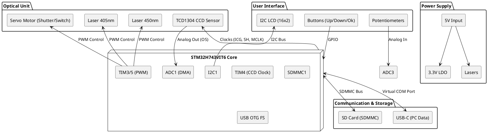
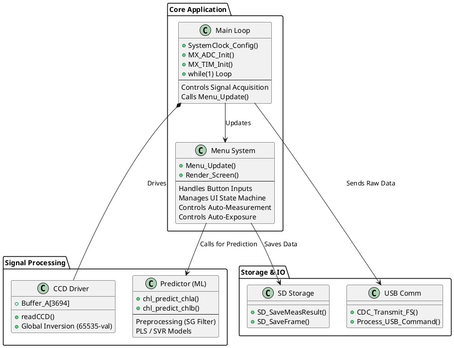
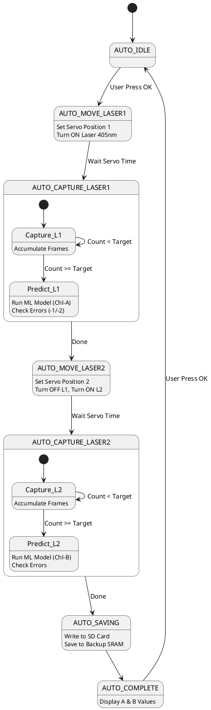
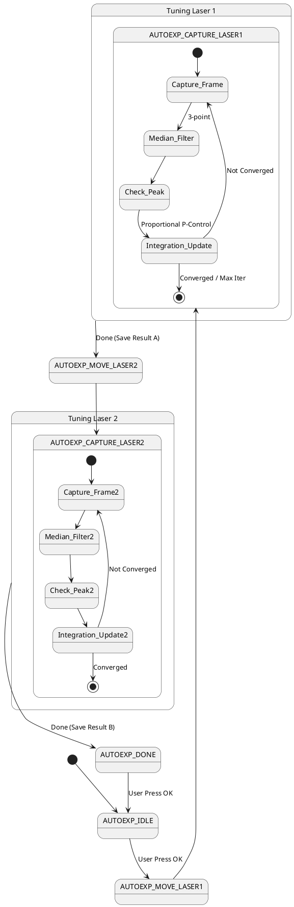
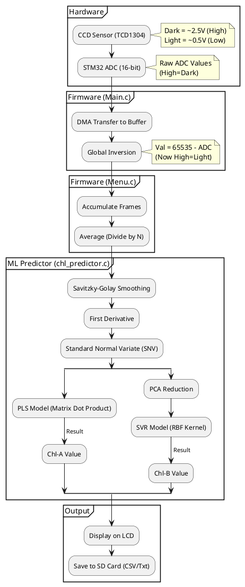

# System Architecture Diagrams

This document contains PlantUML diagrams for the TCD1304 Spectrometer project. You can copy the code blocks below and paste them into any PlantUML viewer (like [PlantText](https://www.planttext.com/)) or use the Markdown Kroki extension to view them.

## 1. Hardware Block Diagram

This diagram shows the physical connections between the STM32H7 microcontroller and the various peripherals (CCD Sensor, Lasers, Display, Storage).

## 2. Firmware Architecture

This diagram illustrates the organization of the C code, specifically the `main` loop, the `menu` system helper, and the machine learning predictor.

## 3. Auto-Measurement State Machine

This diagram details the logic flow within the "Auto Measure" feature in `menu.c`, showing how the device switches lasers, captures frames, and ensures valid predictions.

## 4. Auto-Exposure State Machine (NEW)

This diagram details the new Auto-Exposure logic which optimizes integration time based on peak signal intensity.

## 5. Signal Processing Data Flow

This diagram explains how the raw analog signal from the CCD is transformed into the final Chlorophyll concentration value.

